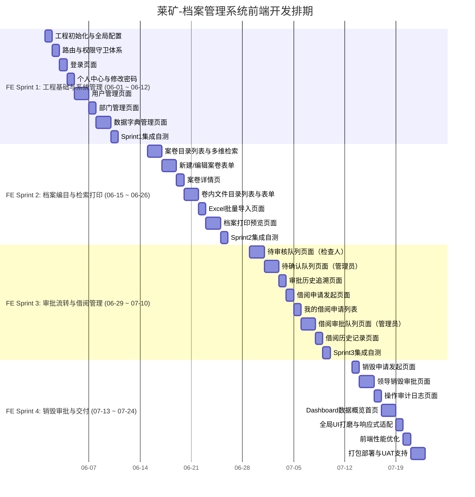

# 莱矿-档案管理系统前端页面开发计划

本计划作为"档案管理系统开发计划.md"的前端专项补充，与后端 4 个 Sprint 同步排期，由 **FE-1** 主导实施。UI 风格采用"**活力新知风（清新人文）**"，以青绿 `#14B8A6` 为主色，暖橙 `#FB923C` 为辅色，传递"档案是活的知识"理念。

---

## 一、技术栈与工程约定

| 层级 | 选型 | 说明 |
|---|---|---|
| 框架 | Vue 3 (Composition API) | `<script setup>` 语法，单文件组件 |
| 组件库 | Element Plus 2.x | 按需引入（unplugin-vue-components） |
| 状态管理 | Pinia | 替代 Vuex，轻量且对 TypeScript 友好 |
| 路由 | Vue Router 4 | History 模式，路由级权限守卫 |
| HTTP | Axios | 统一封装，自动携带 Token、拦截 `Result` 响应 |
| 构建工具 | Vite 5 | 极速冷启动，按模块代码分割 |
| 类型系统 | TypeScript 5 | 严格模式，接口 VO/DTO 类型共享 |
| 样式 | SCSS + CSS 变量 | 主题色通过 CSS 变量全局注入，一键换色 |
| 表格/图表 | Element Plus Table + ECharts 5 | Dashboard 数据可视化 |
| 打印预览 | 浏览器内置打印 + CSS `@media print` | 配合后端返回 `.docx` 流下载 |

### 1.1 工程目录结构

```
lkda-web/
├── public/
│   └── favicon.ico
├── src/
│   ├── api/                     # 按模块划分接口定义
│   │   ├── auth.ts
│   │   ├── system/              # 用户、部门、字典
│   │   ├── volume/              # 案卷
│   │   ├── file/                # 文件
│   │   ├── borrow/              # 借阅
│   │   └── approve/             # 审批
│   ├── assets/
│   │   ├── icons/               # 线性双色图标 SVG
│   │   └── illustrations/       # 空状态插画
│   ├── components/              # 全局公共组件
│   │   ├── AppLayout.vue        # 整体布局框架
│   │   ├── PageHeader.vue       # 页面标题 + 面包屑
│   │   ├── StatusTag.vue        # 档案/借阅状态胶囊标签
│   │   ├── EmptyState.vue       # 空状态插画组件
│   │   ├── ArchiveNoPreview.vue # 档号预览生成组件
│   │   └── PrintLayout.vue      # 打印专用布局
│   ├── layouts/
│   │   ├── AuthLayout.vue       # 登录/找回密码专用布局
│   │   └── MainLayout.vue       # 主框架：顶栏 + 侧边栏 + 内容区
│   ├── router/
│   │   ├── index.ts             # 路由总入口
│   │   ├── guards.ts            # 全局路由守卫（鉴权、权限）
│   │   └── modules/             # 按业务模块拆分路由文件
│   ├── stores/
│   │   ├── auth.ts              # 用户信息、Token、角色权限
│   │   ├── dict.ts              # 数据字典全局缓存（页面初始化一次性加载）
│   │   └── notify.ts            # 系统待办通知
│   ├── types/                   # 全局 TypeScript 类型
│   │   ├── api.d.ts             # Result<T>、分页 Page<T>
│   │   └── vo/                  # VO 类型定义（与后端命名对齐）
│   ├── utils/
│   │   ├── http.ts              # Axios 实例 + 拦截器
│   │   ├── auth.ts              # Token 读写工具
│   │   ├── dict.ts              # 字典 label 转换辅助函数
│   │   └── desensitize.ts       # 手机号脱敏前端工具
│   └── views/                   # 页面视图（与路由模块对应）
│       ├── auth/
│       ├── dashboard/
│       ├── system/
│       ├── volume/
│       ├── file/
│       ├── borrow/
│       ├── approve/
│       └── destroy/
├── .env.development
├── .env.production
├── vite.config.ts
└── tsconfig.json
```

### 1.2 全局设计规范（活力新知风）

```scss
// src/styles/variables.scss
:root {
  // 主色：青绿
  --color-primary:        #14B8A6;
  --color-primary-light:  #5EEAD4;
  --color-primary-dark:   #0F766E;

  // 辅色：暖橙（提醒、标签、点缀）
  --color-accent:         #FB923C;

  // 背景
  --color-bg-main:        #FFFFFF;
  --color-bg-aside:       #ECFDF5;   // 薄荷绿浅底

  // 文字
  --color-text-title:     #1E293B;   // 深 slate
  --color-text-body:      #475569;

  // 状态点缀
  --color-warn:           #FDE68A;   // 淡黄，待办标记
  --color-tag-special:    #A78BFA;   // 淡紫，特殊分类

  // 圆角
  --radius-card:          16px;
  --radius-btn:           8px;
  --radius-tag:           999px;     // 胶囊型

  // 阴影
  --shadow-card:          0 2px 12px rgba(20, 184, 166, 0.08);
}
```

**组件统一规则：**

| 元素 | 规格 |
|---|---|
| 卡片圆角 | `16px`，带微阴影 `--shadow-card` |
| 主按钮 | 青绿底白字，圆角 `8px`，hover 轻微上浮 `translateY(-1px)` |
| 状态标签 | 胶囊型（`border-radius: 999px`），不同状态不同底色 |
| 侧边栏选中态 | 青绿渐变底 `linear-gradient(135deg, #14B8A6, #0F766E)` |
| 空状态页 | 插画风格 SVG + 友好中文提示 |
| 表格行 hover | `#ECFDF5` 薄荷绿浅底 |

---

## 二、页面清单总览

| 模块 | 页面名称 | 路由路径 | 所属 Sprint | 角色可见 |
|---|---|---|---|---|
| **认证** | 登录页 | `/login` | S1 | 全部 |
| **认证** | 修改密码 | `/profile/password` | S1 | 全部 |
| **个人中心** | 个人信息 | `/profile` | S1 | 全部 |
| **Dashboard** | 数据概览首页 | `/dashboard` | S4 | 全部 |
| **系统管理** | 用户管理列表 | `/system/user` | S1 | 管理员 |
| **系统管理** | 部门管理（树形） | `/system/dept` | S1 | 管理员 |
| **系统管理** | 数据字典管理 | `/system/dict` | S1 | 管理员 |
| **案卷管理** | 案卷目录列表（检索） | `/volume/list` | S2 | 全部 |
| **案卷管理** | 新建/编辑案卷表单 | `/volume/edit/:id?` | S2 | 普通用户/管理员 |
| **案卷管理** | 案卷详情 | `/volume/detail/:id` | S2 | 全部 |
| **案卷管理** | Excel 批量导入 | `/volume/import` | S2 | 管理员 |
| **文件管理** | 卷内文件目录列表 | `/file/list/:volumeId` | S2 | 全部 |
| **文件管理** | 新建/编辑文件表单 | `/file/edit/:id?` | S2 | 普通用户/管理员 |
| **打印输出** | 档案打印预览 | `/print/preview/:volumeId` | S2 | 全部 |
| **归档审批** | 待审核队列（检查人） | `/approve/review` | S3 | 检查人/管理员 |
| **归档审批** | 待确认队列（管理员） | `/approve/confirm` | S3 | 管理员 |
| **归档审批** | 审批历史追溯 | `/approve/history` | S3 | 管理员 |
| **借阅管理** | 我的借阅申请 | `/borrow/my` | S3 | 全部 |
| **借阅管理** | 发起借阅申请 | `/borrow/apply/:archiveNo` | S3 | 普通用户 |
| **借阅管理** | 借阅审批队列 | `/borrow/approve` | S3 | 管理员 |
| **借阅管理** | 部门/全量借阅历史 | `/borrow/history` | S3 | 全部（权限隔离） |
| **销毁审批** | 销毁申请发起 | `/destroy/apply` | S4 | 管理员 |
| **销毁审批** | 领导销毁审批队列 | `/destroy/approve` | S4 | 公司领导 |
| **审计日志** | 操作审计日志 | `/audit/log` | S4 | 管理员 |

---

## 三、Sprint 详细任务拆解

### FE Sprint 1：工程搭建、认证与系统管理页面
**周期：2026-06-01 至 2026-06-12（与后端 S1 同步）**

**Sprint 目标：** 完成前端工程脚手架搭建，实现登录认证闭环，完成用户/部门/数据字典三大系统管理页面，为后续档案业务模块提供字典数据支撑。

#### 任务拆解表

| 任务 ID | 任务名称 | 描述 | 工期(天) | 验收标准 |
|---|---|---|---|---|
| **FE1-01** | 工程初始化与全局配置 | 1. Vite + Vue 3 + TS 脚手架搭建<br>2. 配置 Element Plus 按需引入<br>3. 配置 Axios 拦截器（自动注入 Token、统一处理 `Result<T>`、401 跳转登录）<br>4. 配置 CSS 变量主题、SCSS 全局变量<br>5. 搭建 `MainLayout`（顶栏 + 侧边栏 + 内容区）骨架 | 1 | 1. `npm run dev` 正常启动，空白框架可访问<br>2. Axios 拦截器在 401 时自动跳转 `/login` |
| **FE1-02** | 路由与权限守卫体系 | 1. 配置 Vue Router 4，划分 `AuthLayout`（登录）和 `MainLayout`（主框架）两套布局<br>2. 全局路由守卫：未登录跳登录页，已登录访问 `/login` 跳首页<br>3. 基于角色的菜单动态渲染（根据 Pinia `auth.store` 中的角色过滤侧边栏菜单） | 1 | 1. 未登录直接访问 `/volume/list` 被拦截并跳转至登录页<br>2. 普通用户登录后侧边栏不展示"用户管理"等管理员菜单 |
| **FE1-03** | 登录页面 | 1. **页面设计**：青绿渐变背景 + 白色毛玻璃（`backdrop-filter: blur`）卡片居中；Logo + "莱矿档案管理系统"标题；用户名/密码输入框；登录按钮（圆角，hover 上浮动画）<br>2. 前端密码正则校验（`^(?=.*[A-Za-z])(?=.*\d)(?=.*[$@$!%*#?&])[A-Za-z\d$@$!%*#?&]{6,}$`）登录场景不强制但给出友好提示<br>3. 调用 `POST /api/auth/login`，Token 写入 Pinia + localStorage；字典数据一次性预加载至 `dict.store` | 1 | 1. 登录成功后跳转 `/dashboard`，侧边栏角色菜单正确渲染<br>2. 用户名/密码错误时显示来自后端的 `msg` 提示 |
| **FE1-04** | 个人中心与修改密码页 | 1. 个人信息卡片：显示昵称、手机号（脱敏展示 `138****5678`）、部门、角色<br>2. 修改密码表单（旧密码、新密码、确认新密码），前后端双重正则校验<br>3. 修改成功后自动退出，跳转登录页 | 1 | 1. 手机号在个人中心以脱敏形式显示<br>2. 不符合密码规则时前端实时提示，不发出请求 |
| **FE1-05** | 用户管理页面 | 1. 用户列表（分页表格）：展示用户名、昵称、部门、角色、账号状态（启用/禁用）、操作栏<br>2. 新建/编辑用户抽屉（Drawer）：输入用户名、昵称、手机号、选择部门（树形 Select）、选择角色、设置初始密码<br>3. 启用/禁用账号操作（二次确认弹窗）<br>4. 重置密码操作 | 2 | 1. 用户列表支持按用户名、部门筛选<br>2. 创建用户时密码字段必须满足强度规则，否则不可提交 |
| **FE1-06** | 部门管理页面 | 1. 左侧树形面板 + 右侧操作区二栏布局<br>2. 树形面板：展示部门层级，支持展开/收起，选中高亮（青绿色）<br>3. 右侧：新增子部门、编辑当前节点名称/排序、删除（叶子节点才可删除）<br>4. 拖拽排序（基于 `@vueuse/core` sortable 或 Element Plus Tree 拖拽） | 1 | 1. 部门树层级正确渲染（`parent_id=0` 为顶层）<br>2. 新增部门后树形结构实时刷新 |
| **FE1-07** | 数据字典管理页面 | 1. 字典主表列表（左列）：字典编码、字典名称、操作（编辑/停用）<br>2. 点击字典主表行，右侧显示字典项列表（`item_value`、`item_label`、排序）<br>3. 字典项支持增删改排序<br>4. 字典变更后触发 `dict.store` 重新加载（通知全局下拉框更新） | 2 | 1. 字典项的增删改操作后，"案卷编目"页面的密级、保管期限下拉框同步更新<br>2. 停用的字典项不在业务下拉框中出现 |
| **FE1-08** | Sprint 1 集成自测 | 走通完整注册→登录→字典配置→部门创建→用户创建全链路 | 1 | 所有页面接口联调通过，无控制台报错 |

---

### FE Sprint 2：核心档案编目、检索与打印预览页面
**周期：2026-06-15 至 2026-06-26（与后端 S2 同步）**

**Sprint 目标：** 实现档案系统最核心的案卷编目录入、卷内文件管理、多维检索、Excel 批量导入以及打印预览功能，完成档案从"录入"到"查阅"的完整前端闭环。

#### 任务拆解表

| 任务 ID | 任务名称 | 描述 | 工期(天) | 验收标准 |
|---|---|---|---|---|
| **FE2-01** | 案卷目录列表与多维检索页 | **检索区（折叠面板）：**<br>- 精确筛选：年度（Select）、一级/二级类目（联动 Select）、状态（Select）、是否在库（Select）<br>- 模糊搜索：输入框支持"案卷题名、档号、主题词"全局模糊匹配<br>**结果区（卡片/表格切换）：**<br>- 默认表格视图：档号、案卷题名、年度、密级标签（胶囊）、状态标签（胶囊）、在库状态、操作栏<br>- 卡片视图：每卡显示图标、题名、年度、密级标签、状态胶囊<br>- 分页控件（每页 20/50 条）<br>- 顶部工具栏：新建按钮、批量导入按钮、导出按钮 | 2 | 1. 切换年度/类目下拉后，列表实时刷新且走 `idx_composite_search` 路径<br>2. 卡片/表格视图切换流畅，状态记忆（Pinia）<br>3. 已销毁档案（`destroy_flag=1`）不在列表中出现 |
| **FE2-02** | 新建/编辑案卷表单 | **表单分区：**<br>- 第一区「基础信息」：全宗号（Select 字典）、年度（Select）、一/二/三级类目（联动 Select）、设备代号（Select）<br>- 档号预览区：选完上述字段后，异步请求 `GET /api/volume/preview-no` 自动展示当前档号，青绿色醒目展示<br>- 第二区「案卷描述」：案卷题名（必填）、编制单位、密级（Select）、保管期限（Select）、件数、页数<br>- 第三区「流程信息」：立卷人、立卷日期、审核人、归档日期<br>- 第四区「备考」：备考说明、备注（Textarea）<br>**底部操作栏：**「保存草稿」（青绿次按钮）、「提交审核」（青绿主按钮）、「取消」 | 2 | 1. 前置下拉框变化后，档号预览实时更新（防抖 300ms）<br>2. 草稿保存时状态为 `0`，提交审核后状态变为 `1`，表单变为只读<br>3. 所有字典下拉项来自 `dict.store` 缓存，不触发额外请求 |
| **FE2-03** | 案卷详情页 | 1. 分区展示案卷全部字段（只读态），样式与表单分区对应<br>2. 顶部状态时间线：草稿→待审核→待确认→已归档，当前节点高亮<br>3. 审批历史区：表格展示 `archive_approve_log`，含审批人、动作（通过/驳回/退回）、意见、时间<br>4. 操作栏（根据角色和状态动态显示）：编辑、提交审核、申请借阅、打印、申请销毁 | 1 | 1. 状态时间线与实际 `status` 字段一致<br>2. 草稿状态下显示"编辑"按钮，已归档状态下不显示编辑 |
| **FE2-04** | 卷内文件目录列表与表单 | **文件列表页（嵌入案卷详情或独立页面）：**<br>- 表格展示：顺序号、文件编号、文件标题、责任者、页数、密级、操作<br>- 支持按顺序号拖拽排序（草稿状态）<br>- 操作：新建文件、编辑、删除（草稿态）<br>**文件新建/编辑表单（抽屉 Drawer 形式）：**<br>- 关联案卷号（自动带入，只读）、顺序号（自动递增，可调整）、文件编号、文件标题（必填）、责任者、页数、密级、归档日期、主题词（Tag 输入）、原文路径 | 2 | 1. 拖拽排序后顺序号自动重排并保存<br>2. 文件表单中所有字典下拉均来自缓存，无额外请求 |
| **FE2-05** | Excel 批量导入页面 | **步骤流程（3步向导）：**<br>- Step 1「下载模板」：展示模板说明（列名、格式要求），提供模板下载按钮<br>- Step 2「上传文件」：拖拽上传区（`.xlsx` 格式），上传后展示预校验结果<br>- Step 3「导入确认」：若无错误则显示"即将导入 XX 条记录"；若有错误，红色高亮展示"第 X 行第 Y 列：×××错误"，全部列出，提示修正后重传<br>**导入结果反馈：** 成功后自动跳转案卷列表，显示"成功导入 XX 条，状态已初始化为待审核" | 1 | 1. 上传非 `.xlsx` 文件时前端拦截，给出格式错误提示<br>2. 后端返回行列级错误时，页面准确定位并高亮展示每一条错误信息<br>3. 导入成功后 `status=1`（待审核），列表中可见 |
| **FE2-06** | 档案打印预览页面 | **预览界面：**<br>- 顶部 Tab 切换：封皮 / 侧脊 / 案卷目录 / 卷内文件目录<br>- 内容区：模拟 A4 纸张白底样式，展示对应内容的排版预览<br>- CSS `@media print` 去除导航栏，仅打印内容区<br>**操作栏：** 「下载 Word(.docx)」按钮触发后端接口，以二进制流形式下载；「直接打印」调用 `window.print()` | 2 | 1. 下载的 `.docx` 文件在 WPS/Office 中能正常打开且排版完整<br>2. 浏览器打印时仅显示档案内容，不含页面导航栏和操作按钮 |
| **FE2-07** | Sprint 2 集成自测 | 走通"新建草稿→档号预览→填写信息→提交→查看详情→卷内文件录入→打印预览下载"完整链路 | 1 | 所有页面接口联调通过，档号预览与后端生成一致 |

---

### FE Sprint 3：审批流转与借阅管理页面
**周期：2026-06-29 至 2026-07-10（与后端 S3 同步）**

**Sprint 目标：** 实现归档审批工作流的可视化操作界面，完成借阅申请、审批、归还全链路前端页面，并直观展示到期提醒与逾期预警状态。

#### 任务拆解表

| 任务 ID | 任务名称 | 描述 | 工期(天) | 验收标准 |
|---|---|---|---|---|
| **FE3-01** | 待审核队列页面（检查人视角） | **列表：** 展示所有 `status=1` 的案卷，含档号、案卷题名、立卷人、提交时间、年度<br>**操作：** 点击"审核"弹出侧滑 Drawer，展示案卷完整信息（只读）+ 审批历史<br>**审批操作区（底部固定）：**<br>- 审批意见 Textarea（必填）<br>- 「通过」（青绿按钮）→ 状态变为 `status=2`（待确认）<br>- 「驳回」（暖橙按钮）→ 状态退回 `status=0`（草稿），审批日志写入<br>审批日志审批动作对应 `PASS` / `REJECT` | 2 | 1. 通过后，案卷从此队列中消失，进入管理员"待确认"队列<br>2. 驳回后，立卷人重新可见该档案且可编辑<br>3. 每次审批操作写入 `archive_approve_log` |
| **FE3-02** | 待确认队列页面（管理员视角） | **列表：** 展示所有 `status=2` 的案卷<br>**操作：** 点击"确认归档"弹出确认对话框（含档案信息摘要，防误操作）<br>- 「确认归档」→ 状态变为 `status=3`（已正式归档），`archive_date` 记录当前日期<br>- 「退回」→ 弹窗输入退回原因，状态回退至 `status=1`（待审核）<br>确认归档为高危不可逆操作，弹窗需二次输入"CONFIRM"字符串确认 | 2 | 1. 确认归档后，档案对全员可查，`status=3`，不可编辑<br>2. 退回操作将审批意见写入日志，立卷人收到系统通知 |
| **FE3-03** | 审批历史追溯页面 | **筛选区：** 业务类型（归档审核/借阅审批/销毁审批）、审批人、日期范围<br>**列表：** 展示审批记录，含业务类型、目标档号、审批人、动作（彩色标签）、意见摘要、时间<br>点击行展开完整审批意见 | 1 | 所有审批操作在历史页面均可追溯，支持按档号关键词搜索 |
| **FE3-04** | 借阅申请发起页面 | **入口：** 从案卷详情页"申请借阅"按钮跳入，档号自动带入<br>**表单：**<br>- 档号（只读）、档案名称（只读）、剩余在库份数（只读，后端计算）<br>- 申请份数（数字输入，≤剩余份数）<br>- 借阅期限（日期选择器，选择归还日期）<br>- 借阅原因（Textarea）<br>「提交申请」→ `status=0`（待审批），跳转至"我的借阅" | 1 | 1. 申请份数不能超过剩余份数，超出时前端拦截<br>2. 已被完全借空（`borrowed_copies == copies`）的档案，案卷详情页不显示"申请借阅"按钮 |
| **FE3-05** | 我的借阅申请列表 | **列表：** 展示当前用户的所有借阅记录<br>**状态标签规则（胶囊型）：**<br>- 待审批：淡灰底黑字<br>- 已借出：青绿底白字 + 剩余天数（`剩余X天`）<br>- 剩余 ≤ 3 天：暖橙底，醒目提醒<br>- 逾期：红色底白字 `已逾期 X 天`<br>- 已驳回：灰底横线文字<br>- 已归还：绿色底<br>**操作：** 点击查看借阅详情（含审批意见） | 1 | 1. 剩余天数实时计算，颜色阈值严格对应（≤3天橙，逾期红）<br>2. 已归还和已驳回记录可查看，不可再操作 |
| **FE3-06** | 借阅审批队列页面（管理员） | **列表：** 展示所有 `status=0`（待审批）的借阅申请<br>**操作：** 点击"审批"弹出 Drawer<br>- 展示申请人信息（昵称、脱敏手机号、部门）、申请档案信息、借阅原因、申请时间<br>- 审批意见（必填）<br>- 「批准」→ `status=1`，`in_stock=0`，`borrowed_copies += 申请份数`<br>- 「驳回」→ `status=2`，写审批日志 | 2 | 1. 批准后档案在库状态在案卷列表实时变为"借出"<br>2. 申请人的"我的借阅"页面状态实时更新 |
| **FE3-07** | 借阅历史记录页面 | **权限分级展示：**<br>- 普通用户：仅显示本部门借阅历史（后端接口已做数据隔离）<br>- 管理员：显示全量历史，可按部门、日期、状态筛选<br>**列表：** 展示档号、借阅人、部门、借出时间、归还时间、逾期天数、操作<br>**归还操作：** 管理员可对"已借出"记录点击"登记归还"，弹窗确认后更新 `status=3`，`in_stock=1`，`borrowed_copies` 回减 | 1 | 1. 普通用户无法看到其他部门借阅记录（前端菜单隔离 + 后端接口校验）<br>2. 归还后逾期天数归零，不再显示 |
| **FE3-08** | Sprint 3 集成自测 | 走通"提交审核→检查人审核通过→管理员确认归档→用户申请借阅→管理员批准→借阅中→逾期提醒→归还"完整闭环 | 1 | 全流程状态变更准确，颜色标签与状态匹配 |

---

### FE Sprint 4：销毁审批、审计日志、Dashboard 与交付
**周期：2026-07-13 至 2026-07-24（与后端 S4 同步）**

**Sprint 目标：** 完成最高权限销毁审批页面和审计日志展示，构建 Dashboard 数据概览，完成整体 UI 打磨、前端性能优化，配合 UAT 验收。

#### 任务拆解表

| 任务 ID | 任务名称 | 描述 | 工期(天) | 验收标准 |
|---|---|---|---|---|
| **FE4-01** | 销毁申请发起页面（管理员） | **入口：** 案卷详情页"申请销毁"按钮（仅管理员可见，仅 `status=3` 已归档才可操作）<br>**表单：**<br>- 档号、案卷题名（只读）<br>- 销毁原因（Textarea，必填，≥20字）<br>- 销毁依据文件（可选上传 `.pdf`）<br>**提交后：** 流入领导审批队列，案卷状态展示"销毁待审批"标签（淡紫胶囊）<br>提交前必须弹出二次确认弹窗，明示"此操作将使档案进入销毁审批流程，经领导批准后无法恢复" | 1 | 1. 销毁原因少于20字时前端不可提交<br>2. 提交成功后案卷详情页出现"销毁待审批"状态标签<br>3. 普通用户无法看到"申请销毁"按钮 |
| **FE4-02** | 领导销毁审批页面（公司领导角色） | **列表：** 展示所有待销毁审批的案卷，含档号、题名、年度、申请人、申请时间、销毁原因摘要<br>**操作：** 点击"审批"弹出 Drawer<br>- 展示案卷完整信息和销毁申请理由<br>- 审批意见（必填）<br>- 「批准销毁」：红色高危按钮，点击后弹出二次确认框，要求输入"批准销毁"文字后才可提交，`destroy_flag=1`，写入审计日志（含操作人、IP、时间、销毁原因）<br>- 「驳回」：暖橙按钮，档案恢复正常已归档状态 | 2 | 1. 批准后，该案卷在所有日常检索、借阅界面均不可见<br>2. 审计日志中能追溯销毁操作的所有字段（操作人、traceId、档号、原因） |
| **FE4-03** | 操作审计日志页面 | **筛选区：** 操作类型（归档确认/销毁审批/登录）、操作人、日期范围<br>**列表：** 时间、操作人（昵称）、操作类型、目标档号、操作结果（成功/驳回）、审计摘要<br>**特殊标记：** 销毁类操作条目显示红色警示图标<br>**只读：** 审计日志页面无任何写操作入口 | 1 | 所有高危操作（确认归档、批准销毁）在审计日志中有完整记录，不可删除 |
| **FE4-04** | Dashboard 数据概览首页 | **顶部数据卡片（4 个，青绿大数字 + 动态计数动画）：**<br>- 总案卷数 / 已正式归档数 / 当前借出数 / 待处理审批数<br>**中部图表区（ECharts）：**<br>- 左：年度档案归档趋势折线图（近5年）<br>- 右：档案状态分布饼图（草稿/待审/待确认/已归档）<br>**下部快捷入口：** 待我审核 N 条（醒目数字徽标）、逾期未还 N 条（红色徽标）、我的借阅<br>**空状态处理：** 当数据为0时显示友好插画（"档案柜正在整理中"），替代空白页 | 2 | 1. 数字卡片计数动画流畅（requestAnimationFrame）<br>2. 待处理审批数与实际队列数量一致（轮询或 SSE 推送） |
| **FE4-05** | 全局 UI 打磨与响应式适配 | 1. 确保所有状态标签、空状态页、加载状态（Skeleton 占位）符合活力新知风设计规范<br>2. 表格 hover 行颜色为 `#ECFDF5`，选中行为 `#CCFBF1`<br>3. 侧边栏菜单选中态青绿渐变，图标双色线性风格<br>4. 响应式布局：筛选区在小屏下折叠为抽屉式<br>5. 按需 import Element Plus 组件，打包体积 ≤ 2MB | 1 | 1. 所有主色调均使用 CSS 变量，修改 `--color-primary` 即可全局换色<br>2. `npm run build` 生成产物 gzip 后 ≤ 2MB |
| **FE4-06** | 前端性能优化 | 1. 路由懒加载（`defineAsyncComponent` / 动态 import）<br>2. 字典数据 Pinia persist，页面刷新后无需重新请求<br>3. 大列表使用虚拟滚动（Element Plus 虚拟表格）<br>4. Axios 请求并发控制（同一接口 300ms 内防重复请求） | 1 | 首屏加载 LCP ≤ 2s（生产环境 Nginx Gzip + 缓存策略下测量） |
| **FE4-07** | 前端打包部署与 UAT 支持 | 1. 配置 `.env.production`（生产 API BaseURL 指向 Nginx 反代地址）<br>2. `npm run build` 生成 `dist/` 目录，部署至 Nginx `html/` 目录<br>3. Nginx 配置 `try_files $uri /index.html`（History 模式 fallback）<br>4. 配合 UAT 过程修复界面级 Bug，响应时间 ≤ 4h | 2 | 1. 生产环境前端通过 Nginx 正常访问，API 请求转发无 CORS 报错<br>2. UAT 发现的界面 Bug 在验收周期内全部修复 |

---

## 四、页面详细设计规范

### 4.1 状态标签配色规范（`StatusTag.vue`）

#### 档案状态（`archive_volume.status`）

| status 值 | 显示文字 | 胶囊背景色 | 文字颜色 |
|---|---|---|---|
| `0` | 草稿 | `#F1F5F9` | `#64748B` |
| `1` | 待审核 | `#FEF9C3` | `#854D0E` |
| `2` | 待确认 | `#DBEAFE` | `#1D4ED8` |
| `3` | 已归档 | `#D1FAE5` | `#065F46` |
| 销毁待审批 | 销毁待审批 | `#EDE9FE` | `#5B21B6` |
| 已销毁 | 已销毁 | `#FEE2E2` | `#991B1B` |

#### 借阅状态（`archive_borrow.status`）

| status 值 | 显示文字 | 胶囊背景色 | 文字颜色 |
|---|---|---|---|
| `0` | 待审批 | `#F1F5F9` | `#64748B` |
| `1`（剩余>3天） | 已借出 · 剩余X天 | `#CCFBF1` | `#0F766E` |
| `1`（剩余≤3天） | 即将到期 · 剩余X天 | `#FFEDD5` | `#C2410C` |
| `2` | 已驳回 | `#FEE2E2` | `#991B1B` |
| `3` | 已归还 | `#D1FAE5` | `#065F46` |
| `4` | 逾期未还 | `#FEE2E2` | `#B91C1C` |

#### 在库状态（`archive_volume.in_stock`）

| in_stock | 显示文字 | 颜色 |
|---|---|---|
| `1` | 在库 | `#14B8A6`（青绿）|
| `0` | 借出 | `#FB923C`（暖橙）|

### 4.2 布局结构规范

```
┌──────────────────────────────────────────────────────┐
│  顶部导航栏（高度 60px）                              │
│  ┌─Logo──┐  莱矿-档案管理系统  [通知铃铛] [用户头像▼] │
│  └───────┘  青绿底白字，圆角胶囊型                    │
├────────────┬─────────────────────────────────────────┤
│ 侧边栏     │ 内容区                                   │
│ 宽 220px  │ padding: 24px                            │
│ 背景:      │                                         │
│ #ECFDF5   │  ┌── PageHeader ──────────────────────┐ │
│           │  │ 页面标题 + 面包屑导航               │ │
│ 菜单项:   │  └────────────────────────────────────┘ │
│ 圆角大按钮 │                                         │
│ 图标+文字  │  ┌── 筛选/工具栏区 ──────────────────┐ │
│           │  │ 下拉框 + 搜索框 + 按钮组           │ │
│ 选中:     │  └────────────────────────────────────┘ │
│ 青绿渐变底 │                                         │
│           │  ┌── 数据展示区（表格/卡片）──────────┐ │
│           │  │                                   │ │
│           │  │                                   │ │
│           │  └────────────────────────────────────┘ │
│           │                                         │
│           │  ┌── 分页控件 ──────────────────────┐   │
│           │  └────────────────────────────────┘   │
└────────────┴─────────────────────────────────────────┘
```

### 4.3 表单字段分区示例（新建案卷）

```
┌────────────────────────────────────────────────────┐
│ 新建案卷  ←返回                                     │
├────────────────────────────────────────────────────┤
│ ▶ 第一区：分类定位（档号组成要素）                   │
│   全宗号 [下拉] 年度 [下拉] 一级类目 [下拉]          │
│   二级类目 [下拉] 三级类目 [下拉] 设备代号 [下拉]    │
│                                                    │
│   档号预览：┌─────────────────────────────────┐    │
│             │  01.8.01.0101.01.003             │    │
│             └─────────────────────────────────┘    │
│             ↑ 青绿色大字体，自动计算               │
├────────────────────────────────────────────────────┤
│ ▶ 第二区：案卷描述                                  │
│   案卷题名 [必填输入框，宽度100%]                   │
│   编制单位 [输入框]  密级 [下拉]  保管期限 [下拉]    │
│   件数 [数字]        页数 [数字]                    │
├────────────────────────────────────────────────────┤
│ ▶ 第三区：流程信息                                  │
│   立卷人 [输入框]   立卷日期 [日期选择]              │
│   审核人 [输入框]   归档日期 [日期选择]              │
├────────────────────────────────────────────────────┤
│ ▶ 第四区：备考                                      │
│   备考说明 [Textarea 3行]  备注 [Textarea 3行]      │
├────────────────────────────────────────────────────┤
│    [取消]  [保存草稿]  [提交审核 →]                 │
└────────────────────────────────────────────────────┘
```

### 4.4 API 调用规范

所有接口调用通过 `src/utils/http.ts` 封装的 Axios 实例，统一处理：

```typescript
// 响应拦截器逻辑
response.interceptors.response.use(res => {
  const result = res.data as Result<unknown>
  if (result.code === 2000) {
    return result.data   // 直接返回 data，页面无需处理 code
  }
  if (result.code === 401) {
    authStore.logout()
    router.push('/login')
  }
  // 其他错误统一 ElMessage.error(result.msg)
  return Promise.reject(result)
})
```

**接口模块示例（`src/api/volume/index.ts`）：**

```typescript
import http from '@/utils/http'
import type { ArchiveVolumeListVO, ArchiveVolumeSaveDTO, Page } from '@/types'

export const VolumeApi = {
  list: (params: VolumeQueryDTO) =>
    http.get<Page<ArchiveVolumeListVO>>('/volume/list', { params }),

  previewNo: (params: ArchiveNoPreviewDTO) =>
    http.get<string>('/volume/preview-no', { params }),

  save: (data: ArchiveVolumeSaveDTO) =>
    http.post<void>('/volume/save', data),

  submit: (id: number) =>
    http.post<void>(`/volume/${id}/submit`),
}
```

---

## 五、Pinia Store 规划

### 5.1 `auth.store.ts`（认证与权限）

```typescript
interface AuthState {
  token: string | null
  userInfo: {
    userId: number
    username: string
    nickname: string
    phone: string          // 脱敏后的手机号，直接用于显示
    deptId: number
    deptName: string
    roles: string[]        // ['ROLE_ADMIN', 'ROLE_USER', 'ROLE_LEADER']
    permissions: string[]  // ['archive:destroy', 'borrow:approve', ...]
  } | null
}
```

**用途：** 路由守卫权限判断、侧边栏菜单过滤、页面内操作按钮显隐控制。

### 5.2 `dict.store.ts`（数据字典缓存）

```typescript
interface DictState {
  // key: dict_code, value: DictItem 列表
  dictMap: Record<string, DictItem[]>
  loaded: boolean
}
```

**加载时机：** 登录成功后立即加载，`persist: true` 持久化至 localStorage，字典管理页修改后主动刷新。

**使用方式：**
```typescript
// 组件内获取字典选项
const { getDictItems, getDictLabel } = useDictStore()

// 密级下拉选项
const securityOptions = getDictItems('security_level')

// 将 item_value 转为 item_label 显示
const securityLabel = getDictLabel('security_level', 'secret')  // → '机密'
```

### 5.3 `notify.store.ts`（待办通知）

```typescript
interface NotifyState {
  pendingApprove: number    // 待我审核数量
  overdueCount: number     // 逾期未还数量
  myPendingBorrow: number  // 我的待审批借阅
}
```

**刷新策略：** 进入 Dashboard 时请求，侧边栏菜单图标显示徽标数字。

---

## 六、路由权限矩阵

| 路由路径 | 页面 | 普通用户 | 管理员 | 公司领导 |
|---|---|---|---|---|
| `/login` | 登录 | ✓ | ✓ | ✓ |
| `/dashboard` | 数据概览 | ✓ | ✓ | ✓ |
| `/profile` | 个人中心 | ✓ | ✓ | ✓ |
| `/system/user` | 用户管理 | ✗ | ✓ | ✗ |
| `/system/dept` | 部门管理 | ✗ | ✓ | ✗ |
| `/system/dict` | 字典管理 | ✗ | ✓ | ✗ |
| `/volume/list` | 案卷列表 | ✓（可见归档） | ✓ | ✓ |
| `/volume/edit` | 新建/编辑案卷 | ✓（草稿） | ✓ | ✗ |
| `/volume/import` | Excel 导入 | ✗ | ✓ | ✗ |
| `/file/list/:id` | 卷内文件列表 | ✓ | ✓ | ✓ |
| `/print/preview/:id` | 打印预览 | ✓ | ✓ | ✓ |
| `/approve/review` | 待审核队列 | ✗ | ✓ | ✗ |
| `/approve/confirm` | 待确认队列 | ✗ | ✓ | ✗ |
| `/approve/history` | 审批历史 | ✗ | ✓ | ✓ |
| `/borrow/my` | 我的借阅 | ✓ | ✓ | ✓ |
| `/borrow/apply/:no` | 申请借阅 | ✓ | ✗ | ✗ |
| `/borrow/approve` | 借阅审批 | ✗ | ✓ | ✗ |
| `/borrow/history` | 借阅历史 | ✓（本部门） | ✓（全量） | ✓（全量） |
| `/destroy/apply` | 销毁申请 | ✗ | ✓ | ✗ |
| `/destroy/approve` | 销毁审批 | ✗ | ✗ | ✓ |
| `/audit/log` | 审计日志 | ✗ | ✓ | ✓ |

---

## 七、质量门禁（前端专项）

| 检查项 | 标准 |
|---|---|
| TypeScript 类型覆盖 | 所有 API 调用必须有明确的 VO/DTO 类型定义，禁止 `any` |
| 字典加载策略 | 禁止在表单组件中发起字典请求，必须从 `dict.store` 读取 |
| 敏感数据 | 手机号在前端展示前必须调用 `desensitize()` 工具函数 |
| 越权防护 | 操作按钮的显隐必须基于 `auth.store.permissions` 判断，不得仅依赖路由守卫 |
| 高危操作 | 确认归档、批准销毁必须有二次确认弹窗（需输入关键字方可提交） |
| 打包体积 | `npm run build` 后单 chunk ≤ 500KB，总 gzip ≤ 2MB |
| 加载状态 | 所有列表页、详情页必须有 Skeleton 占位，禁止空白闪烁 |
| 错误处理 | 接口失败时展示来自后端 `Result.msg` 的具体提示，禁止展示技术报错信息 |

---

## 八、Gantt 排期总览（前端专项）


