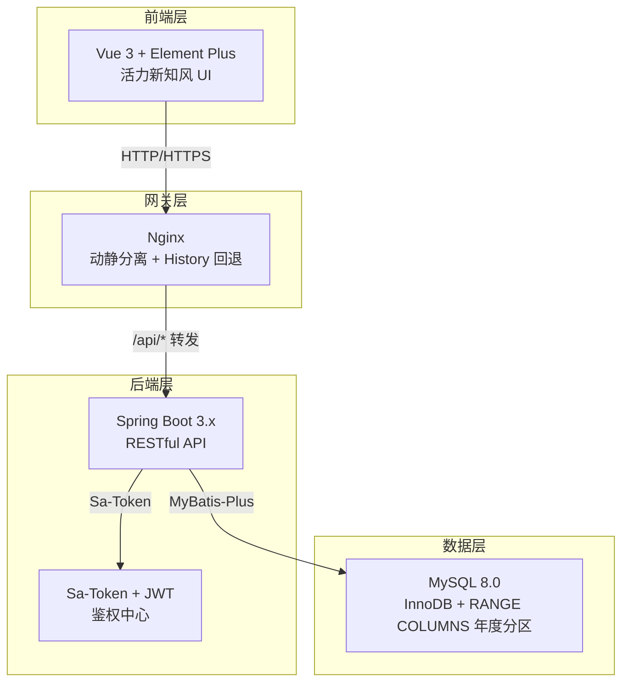
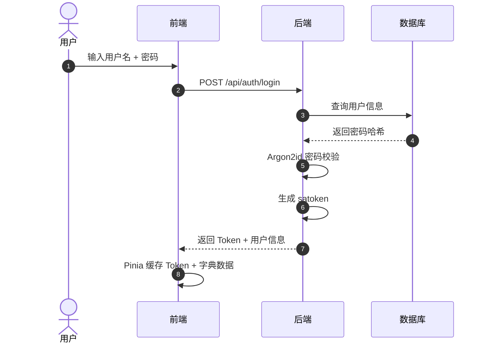
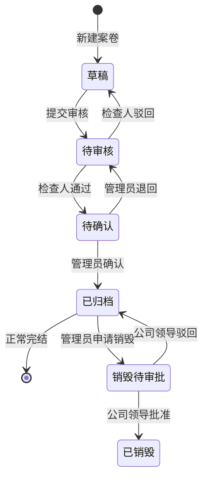
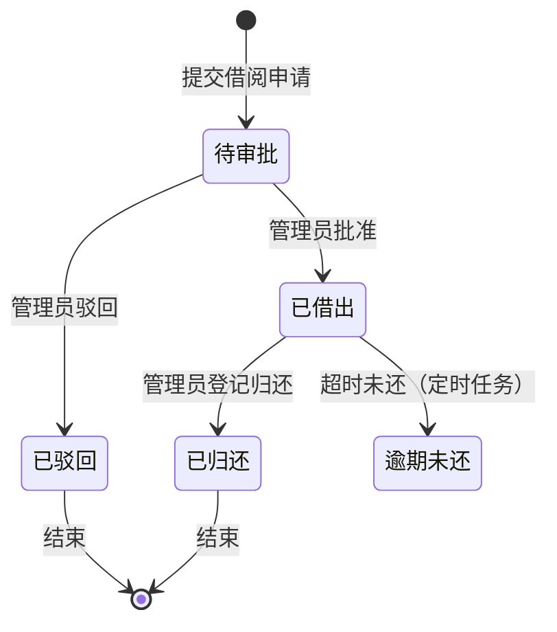

# 莱矿-档案管理系统使用说明

> **版本**: v1.0.0  
> **适用角色**: 普通员工 / 档案管理员 / 公司领导  
> **最后更新**: 2026-05-26

---

## 1. 系统概述

莱矿-档案管理系统是一套面向企业档案管理业务的**前后端分离单体应用**，采用"**案卷-文件**"两级传统档案管理模式，覆盖档案从编目录入、审批归档、借阅流转到销毁审计的**全生命周期管理**。

### 1.1 核心功能模块

| 模块 | 功能说明 | 主要使用角色 |
|---|---|---|
| **系统管理** | 用户管理、部门树管理、数据字典配置 | 档案管理员 |
| **案卷管理** | 案卷编目录入、多维检索、Excel 批量导入、Word 打印 | 全体用户 |
| **文件管理** | 卷内文件明细录入、拖拽排序 | 全体用户 |
| **归档审批** | 待审核队列、待确认队列、审批历史追溯 | 检查人 / 管理员 |
| **借阅管理** | 借阅申请、审批、归还、历史追溯 | 全体用户 |
| **销毁审批** | 销毁申请发起、领导终审、高危操作审计 | 管理员 / 公司领导 |
| **审计日志** | 全链路审批操作审计，支持按类型/人/时间筛选 | 管理员 / 公司领导 |
| **数据概览** | Dashboard 统计卡片、年度趋势图、快捷入口 | 全体用户 |

### 1.2 技术架构



---

## 2. 环境要求与部署

### 2.1 运行环境

| 组件 | 版本要求 | 说明 |
|---|---|---|
| JDK | 17+ | Spring Boot 3.x 运行基础 |
| MySQL | 8.0+ | 必须支持 `RANGE COLUMNS` 分区 |
| Node.js | 18+ | 前端构建依赖 |
| Maven | 3.8+ | 后端编译依赖 |
| Nginx | 1.20+ | 生产环境反向代理（可选） |

### 2.2 数据库初始化

执行项目根目录下 `sql/init.sql` 完成建表与基础数据初始化：

```bash
mysql -u root -p < sql/init.sql
```

> **注意**：`archive_volume` 与 `archive_file` 表采用 **RANGE COLUMNS 物理分区**（按年度 `year` 字段分区）。每年需执行分区扩容脚本，详见第 8 节运维说明。

### 2.3 一键启动（开发环境）

项目根目录提供 `start.sh` 一键启动脚本：

```bash
# 开发模式（后端 dev profile + 前端 Vite dev server）
./start.sh dev

# 生产模式（java -jar + 前端 dist 静态托管）
./start.sh prod
```

启动后访问：
- **前端页面**: http://localhost:5173
- **后端 API**: http://localhost:8080

按 `Ctrl+C` 可优雅停止所有服务。

---

## 3. 登录与认证

### 3.1 首次登录

系统采用 **Sa-Token + JWT** 鉴权体系，登录成功后 Token 自动注入后续请求 Header。



### 3.2 密码规则

系统强制要求密码强度（前后端双重校验）：

- 至少 **6 位**
- 必须同时包含 **大写字母、小写字母、数字、特殊字符**（`$@$!%*#?&`）
- 示例合法密码：`Lk@2026`

### 3.3 角色与权限

系统内置 **三级角色**：

| 角色 | 权限范围 | 特殊说明 |
|---|---|---|
| **普通员工** | 新建/补录档案草稿、申请借阅、查看本部门历史 | 草稿仅自己可见 |
| **档案管理员** | 用户/部门/字典管理、借阅审批、归档确认、Excel 导入 | 拥有大部分管理权限 |
| **公司领导** | 销毁审批终审、全量审计日志查看 | 拥有全部菜单权限 |

---

## 4. 系统管理

> **使用角色**: 档案管理员

### 4.1 用户管理

**路径**: `系统管理 → 用户管理`

- **列表**: 展示用户名、昵称、所属部门、角色、账号状态
- **新增/编辑**: 抽屉式表单，支持选择部门（树形下拉）与角色
- **禁用/启用**: 账号禁用后该用户无法登录
- **重置密码**: 重置为系统默认初始密码
- **手机号脱敏**: 列表中展示为 `138****5678` 格式

### 4.2 部门管理

**路径**: `系统管理 → 部门管理`

- **树形结构**: 左侧展示部门层级，顶层 `parent_id = 0`
- **操作**: 新增子部门、编辑名称与排序、删除（仅叶子节点可删）
- **拖拽排序**: 支持拖拽调整部门显示顺序

### 4.3 数据字典

**路径**: `系统管理 → 数据字典`

- **字典主表**: 左列展示字典编码与名称（如 `security_level` 密级、`retention_period` 保管期限）
- **字典项**: 点击字典主表行，右列展示字典项（`item_value` / `item_label` / 排序 / 状态）
- **停用**: 停用的字典项在业务表单下拉框中不再出现
- **缓存刷新**: 字典修改后自动触发前端 `dict.store` 重新加载

---

## 5. 案卷管理

### 5.1 案卷目录检索

**路径**: `案卷管理 → 案卷目录`

**筛选区**（支持折叠，小屏自动堆叠）：

| 筛选条件 | 类型 | 说明 |
|---|---|---|
| 年度 | 下拉选择 | 2018 ~ 当前年 |
| 一级类目 | 下拉选择 | 联动二级类目 |
| 二级类目 | 下拉选择 | 依赖一级类目 |
| 状态 | 下拉选择 | 草稿 / 待审核 / 待确认 / 已归档 |
| 在库状态 | 下拉选择 | 在库 / 借出 |
| 关键词 | 输入框 | 案卷题名 / 档号 / 主题词 全局模糊匹配 |

**视图切换**: 表格视图 ↔ 卡片视图

- **表格视图**: 档号、案卷题名、年度、密级标签（胶囊）、状态标签、在库状态、操作栏
- **卡片视图**: 图标 + 题名 + 年度 + 标签胶囊，hover 上浮动效

> **性能说明**: 高频组合筛选（年度 + 一级类目 + 状态）走联合索引 `idx_composite_search`，响应时间 < 200ms。

### 5.2 新建/编辑案卷

**路径**: `案卷管理 → 案卷目录 → 新建案卷` 或 表格行"编辑"

**表单分区**：


| 分区 | 字段 | 说明 |
|---|---|---|
| **第一区** | 全宗号、年度、一/二/三级类目、设备代号 | 下拉框数据来自字典缓存 |
| **档号预览** | 自动生成的档号 | 选完前置字段后异步请求后端计算，青绿色醒目展示 |
| **第二区** | 案卷题名（必填）、编制单位、密级、保管期限、件数、页数 | 密级/保管期限来自字典 |
| **第三区** | 立卷人、立卷日期、审核人、归档日期 | 日期选择器 |
| **第四区** | 备考说明、备注 | Textarea |

**底部操作栏**:
- `保存草稿` → 状态变为 `0`（草稿），仅自己可见
- `提交审核` → 状态变为 `1`（待审核），立卷人不可再编辑
- `取消` → 返回列表

### 5.3 案卷详情

**路径**: 点击案卷目录行 → 进入详情

- **顶部状态时间线**: 草稿 → 待审核 → 待确认 → 已归档，当前节点高亮
- **审批历史区**: 表格展示 `archive_approve_log`，含审批人、动作（通过/驳回/退回）、意见、时间
- **操作栏（根据角色和状态动态显示）**:
  - 草稿状态: 编辑、提交审核
  - 已归档状态: 申请借阅、打印、申请销毁（仅管理员）

### 5.4 Excel 批量导入

**路径**: `案卷管理 → Excel 批量导入`

**三步向导**:


| 步骤 | 说明 |
|---|---|
| **Step 1** | 下载 Excel 模板，内含列名与格式要求说明 |
| **Step 2** | 拖拽上传 `.xlsx`，前端校验格式；后端 EasyExcel 逐行校验 |
| **Step 3** | 若有错误，红色高亮"第 X 行第 Y 列：×××错误"；若无错误，确认导入 |

> **注意**: 任一行出错则**全单回滚**，不执行部分成功。导入成功后状态自动初始化为 `1`（待审核）。

### 5.5 档案打印

**路径**: 案卷详情页 → `打印` 或 `案卷管理 → 打印预览`

**顶部 Tab 切换**:
- 封皮
- 侧脊
- 案卷目录
- 卷内文件目录

**操作**:
- `下载 Word(.docx)` → 后端 poi-tl 模板渲染，二进制流下载
- `直接打印` → 调用浏览器 `window.print()`，CSS `@media print` 去除导航栏

---

## 6. 文件管理（卷内文件）

### 6.1 卷内文件目录

**路径**: `案卷管理 → 案卷目录 → 点击案卷 → 查看卷内文件` 或 `/file/list/:volumeId`

**列表字段**: 顺序号、文件编号、文件标题、责任者、页数、密级、主题词、归档日期、操作

**草稿状态特有功能**:
- **拖拽排序**: 拖拽行调整顺序号，自动重排并保存
- **新建/编辑/删除**: 抽屉式表单，顺序号自动递增可调整

---

## 7. 归档审批

### 7.1 审批状态机



### 7.2 待审核队列（检查人视角）

**路径**: `归档审批 → 待审核队列`

- 列表展示所有 `status = 1` 的案卷
- 点击"审核"弹出 Drawer，展示案卷完整信息（只读）+ 审批历史
- **底部固定操作区**:
  - 审批意见 Textarea（必填）
  - `通过`（青绿按钮）→ 状态变为 `2`（待确认）
  - `驳回`（暖橙按钮）→ 状态退回 `0`（草稿），审批日志写入

### 7.3 待确认队列（管理员视角）

**路径**: `归档审批 → 待确认队列`

- 列表展示所有 `status = 2` 的案卷
- 点击"确认归档"弹出确认对话框
  - 含档案信息摘要，防误操作
  - **高危操作**: 需二次输入 `CONFIRM` 字符串验证
  - `确认归档` → 状态变为 `3`（已归档），记录 `archive_date`
  - `退回` → 弹窗输入退回原因，状态回退至 `1`（待审核）

### 7.4 审批历史追溯

**路径**: `归档审批 → 审批历史`

- **筛选区**: 业务类型（归档审核 / 借阅审批 / 销毁审批）、审批人、日期范围
- **列表**: 业务类型、目标档号、审批人、动作（彩色标签）、意见摘要、时间
- **展开行**: 点击行可展开查看完整审批意见
- **销毁类标记**: 销毁审批行显示红色警示条和 `WarningFilled` 图标

---

## 8. 借阅管理

### 8.1 借阅状态机



### 8.2 发起借阅申请

**入口**: 案卷详情页 `申请借阅` 按钮（仅已归档档案可借）

**表单**:
- 档号（只读）、档案名称（只读）
- 剩余在库份数（只读，后端计算 `copies - borrowed_copies`）
- 申请份数（数字输入，≤ 剩余份数，超出前端拦截）
- 借阅期限（日期选择器，选择归还日期）
- 借阅原因（Textarea）

> **注意**: 已被完全借空（`borrowed_copies == copies`）的档案，详情页不显示"申请借阅"按钮。

### 8.3 我的借阅

**路径**: `借阅管理 → 我的借阅`

**状态标签规则**:

| 状态 | 显示文字 | 样式 |
|---|---|---|
| 待审批 | 待审批 | 淡灰底黑字 |
| 已借出（剩余 > 3 天） | 已借出 · 剩余 X 天 | 青绿底白字 |
| 已借出（剩余 ≤ 3 天） | 即将到期 · 剩余 X 天 | 暖橙底 |
| 逾期未还 | 已逾期 X 天 | 红色底白字 |
| 已驳回 | 已驳回 | 灰底横线文字 |
| 已归还 | 已归还 | 绿色底 |

### 8.4 借阅审批（管理员）

**路径**: `借阅管理 → 借阅审批`

- 列表展示所有 `status = 0` 的借阅申请
- 点击"审批"弹出 Drawer
  - 展示申请人信息（昵称、脱敏手机号、部门）
  - 申请档案信息、借阅原因、申请时间
  - 审批意见（必填）
  - `批准` → `status = 1`，`in_stock = 0`，`borrowed_copies += 申请份数`
  - `驳回` → `status = 2`，写审批日志

### 8.5 借阅历史与归还

**路径**: `借阅管理 → 借阅历史`

- **权限分级**:
  - 普通用户: 仅显示本部门借阅历史
  - 管理员: 显示全量历史，可按部门、日期、状态筛选
- **归还操作**: 管理员对"已借出"记录点击"登记归还"，弹窗确认后更新 `status = 3`，`in_stock = 1`，`borrowed_copies` 回减

---

## 9. 销毁审批

> **说明**: 销毁是最高危操作，普通员工及管理员无权直接抹除档案，必须经过公司领导终审。

### 9.1 销毁申请发起（管理员）

**入口**: 案卷详情页 `申请销毁` 按钮（仅 `status = 3` 已归档档案可操作）

**表单**:
- 档号、案卷题名（只读）
- 销毁原因（Textarea，必填，≥ 20 字）
- 销毁依据文件（可选上传 `.pdf`）

**提交前二次确认**:
> "此操作将使档案进入销毁审批流程，经领导批准后无法恢复"

**提交后**: 案卷状态展示"销毁待审批"标签（淡紫胶囊），档案仍可在列表中查看。

### 9.2 领导销毁审批（公司领导）

**路径**: `销毁审批`

- 列表展示所有 `pendingDestroy = 1` 的待审批案卷
- 点击"审批"弹出 Drawer
  - 展示案卷完整信息和销毁申请理由
  - 审批意见（必填）
  - `批准销毁`（红色高危按钮）
    - 点击后弹出二次确认框
    - **需输入"批准销毁"文字验证**
    - 通过后: `destroy_flag = 1`，档案在所有日常检索/借阅界面消失
  - `驳回`（暖橙按钮）→ 档案恢复正常已归档状态

---

## 10. 审计日志

**路径**: `审计日志 → 操作审计日志`

> **说明**: 本页面为**只读**，无任何写操作入口。

**筛选区**:
- 操作类型: 归档审核 / 归档确认 / 销毁审批 / 借阅审批
- 操作人: 输入昵称筛选
- 日期范围: 起止日期选择

**列表字段**:
- 操作时间
- 操作人
- 操作类型（彩色标签）
- 目标档号
- 操作结果（通过 / 驳回 / 退回 / 申请）
- 审计摘要（意见前 40 字）

**特殊标记**: 销毁类操作条目整行带红色警示条和 `WarningFilled` 图标。

**展开行**: 点击行展开查看完整审批意见。

---

## 11. Dashboard 数据概览

**路径**: `/dashboard`（登录后默认首页）

### 11.1 统计卡片（4 张）

| 卡片 | 数据 | 动画 |
|---|---|---|
| 总案卷数 | 系统案卷总量 | 数字滚动计数 |
| 已正式归档数 | `status = 3` 的案卷数 | 数字滚动计数 |
| 当前借出数 | `in_stock = 0` 的案卷数 | 数字滚动计数 |
| 待处理审批数 | 待审核 + 待确认 + 待销毁 | 数字滚动计数，与侧边栏徽标同源 |

### 11.2 图表区

- **年度档案归档趋势折线图**（近 5 年）
- **档案状态分布饼图**（草稿 / 待审 / 待确认 / 已归档）

> ECharts 采用动态 `import()` 按需加载，减少首屏体积。

### 11.3 快捷入口

- `待我审核 N 条` → 跳转待审核队列
- `逾期未还 N 条` → 跳转借阅历史（自动筛选逾期）
- `我的借阅` → 跳转我的借阅列表

---

## 12. 运维与扩展

### 12.1 年度分区扩容

每年需为 `archive_volume` 和 `archive_file` 表新增下一年度分区：

```sql
-- 示例：进入 2028 年时执行
ALTER TABLE `archive_volume` REORGANIZE PARTITION p_future INTO (
  PARTITION p_2028 VALUES LESS THAN ('2029'),
  PARTITION p_future VALUES LESS THAN (MAXVALUE)
);

ALTER TABLE `archive_file` REORGANIZE PARTITION p_future INTO (
  PARTITION p_2028 VALUES LESS THAN ('2029'),
  PARTITION p_future VALUES LESS THAN (MAXVALUE)
);
```

### 12.2 定时任务

系统内置 Spring `@Scheduled` 定时任务，每天凌晨执行：

- 扫描 `status = 1 AND plan_return_date < NOW()` 的借阅记录
- 更新状态为 `4`（逾期）
- 生成系统内待办通知

### 12.3 数据库备份

建议配置 Linux `crontab` 执行每日备份：

```bash
#!/bin/bash
# backup.sh
BACKUP_DIR="/backup/mysql"
DATE=$(date +%Y%m%d)
mysqldump -u root -p archive_db > "$BACKUP_DIR/archive_$DATE.sql"
# 保留最近 30 天
find "$BACKUP_DIR" -name "archive_*.sql" -mtime +30 -delete
```

---

## 13. 常见问题（FAQ）

### Q1: 登录后侧边栏某些菜单不显示？

菜单根据当前用户角色动态过滤。普通员工不展示"用户管理""数据字典"等管理员菜单，公司领导专属"销毁审批"菜单对其他角色隐藏。

### Q2: 案卷提交审核后为什么找不到了？

提交审核后状态变为 `1`（待审核），该档案从立卷人视角变为**只读或不可见**，需由检查人在"待审核队列"中处理。

### Q3: 为什么某些档案在列表中搜不到？

可能原因：
- 档案处于草稿状态（仅立卷人可见）
- 档案已被销毁（`destroy_flag = 1`）
- 检索条件不匹配（尝试重置筛选条件）

### Q4: 借阅申请被驳回后能否再次申请？

可以。已驳回的借阅记录状态为 `2`，不影响对该档案重新发起借阅申请（只要档案仍有在库份数）。

### Q5: 生产环境如何部署？

```bash
# 1. 后端打包
cd /home/ubuntu/lkda
mvn package -DskipTests

# 2. 前端打包
cd lkda-web
npm run build

# 3. Nginx 配置（示例）
server {
    listen 80;
    server_name archive.laikuang.com;

    location / {
        root /home/ubuntu/lkda/lkda-web/dist;
        try_files $uri $uri/ /index.html;
    }

    location /api/ {
        proxy_pass http://localhost:8080/;
        proxy_set_header Host $host;
        proxy_set_header X-Real-IP $remote_addr;
    }
}

# 4. 启动后端
nohup java -jar target/archive-1.0.0.jar --spring.profiles.active=prod > logs/backend.log 2>&1 &
```

---

## 14. 附录

### 14.1 档号生成规则

格式：`全宗号.一级类目.二级类目.三级类目.设备代号.案卷号`

示例：`01.8.01.0101.01.003`

### 14.2 错误码速查

| 错误码 | 含义 |
|---|---|
| `2000` | 操作成功 |
| `4000-4019` | 参数校验异常 |
| `4020-4050` | 业务逻辑冲突（档号重复、借阅超限等） |
| `401 / 403` | 鉴权/越权拦截 |
| `5000` | 系统未知异常 |

### 14.3 联系与支持

如遇系统问题，请联系档案管理员或查阅 `logs/` 目录下的日志文件：
- `logs/backend.log` — 后端运行日志
- `logs/archive.log` — 业务审计日志
- `lkda-web/logs/frontend.log` — 前端构建/运行日志
