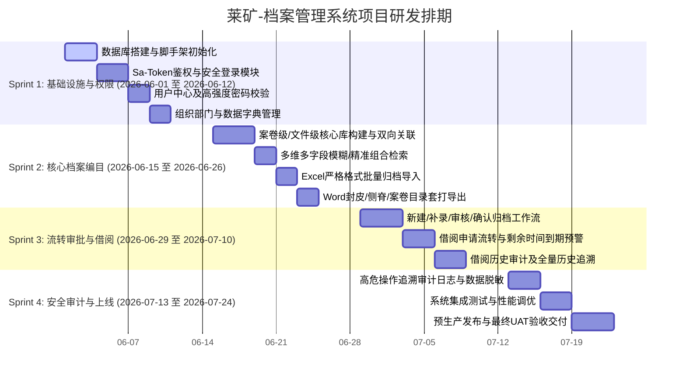

# 莱矿-档案管理系统详细开发计划 (Sprint Plan)

本开发计划基于“莱矿-档案管理系统”的业务需求及技术规范，采用敏捷开发（Agile）模式进行任务拆解。项目共规划为 **4 个 Sprint**，每个 Sprint 为期 **2 周（10个工作日）**，整体周期为 **8 周**。

## 1. 团队角色与职责初始化

为明确各任务执行人，以下为团队成员代号及职责定义：

- **PM/BA**：项目经理/系统分析师（负责业务把控与验收确认）
    
- **BE-1** (Lead)：资深后端开发（负责系统设计、数据库搭建、核心算法及高危安全编码）
    
- **BE-2**：后端开发（负责常规业务模块、数据报表及接口编写）
    
- **FE-1**：前端开发（负责页面搭建、交互逻辑及打印模板前端渲染）
    
- **QA**：软件测试工程师（负责编写测试用例、执行功能/安全测试、发布前把关）
    

## 2. 整体进度甘特图 (Gantt Chart)

使用以下 Mermaid 甘特图直观展示 4 个 Sprint 的任务排期与关键路径：

## 3. 分阶段 Sprint 计划详解

### 3.1 Sprint 1：基础设施、权限及字典体系

- **周期**：2026-06-01 至 2026-06-12
    
- **Sprint 目标**：完成系统基础底座建设，落实 Sa-Token 鉴权体系，打通用户中心、部门管理及数据字典，具备基础数据支持能力。
    

#### 任务级拆解表

|   |   |   |   |   |   |
|---|---|---|---|---|---|
|**任务 ID**|**用户故事 / 任务名称**|**任务描述**|**负责人**|**预估工期 (天)**|**验收标准 (Acceptance Criteria)**|
|**S1-01**|数据库初始化与工程脚手架搭建|1. 依据 DDL 创建 MySQL 表结构、分区策略。      2. 初始化 Spring Boot 工程，集成 MyBatis-Plus、Sa-Token 及通用依赖。|BE-1|3|1. 数据库表（带物理分区）创建成功。      2. 统一响应 `Result`、错误码和全局异常拦截器生效。|
|**S1-02**|登录页面及安全状态认证接口|1. 用户输入用户名/密码登录。      2. 后端执行 Argon2id 密码哈希认证，Sa-Token 颁发 JWT。|BE-1      FE-1|3|1. 禁用明文密码，数据库中保存强哈希。      2. 前端请求 Header 携带 `satoken` 完成鉴权，拦截未登录请求。|
|**S1-03**|用户中心与高强度密码修改|1. 用户个人信息查询与修改（昵称、手机号）。      2. 密码修改必须通过正则校验。|BE-2      FE-1|2|1. 密码必须满6位，包含大/小写字母、数字及特殊字符。      2. 手机号输入框前端及后端均完成格式正则检验。|
|**S1-04**|组织部门与字典管理模块开发|1. 部门管理树状图展示与增删改查。      2. 数据字典主子表管理（支持配置密级、保管期限等）。|BE-2      FE-1|2|1. 字典管理功能可以录入、修改、停用字典。      2. 数据字典能正常为后续档案录入下拉框提供数据源。|
|**S1-05**|Sprint 1 阶段性集成测试|编写系统管理及字典服务的单元/集成测试用例，并执行跑通。|QA|2|1. 完成所有系统管理功能测试，Bug 修复率 $100\%$。      2. 密码强度限制黑盒测试拦截率 $100\%$。|

### 3.2 Sprint 2：核心档案存储、检索与打印

- **周期**：2026-06-15 至 2026-06-26
    
- **Sprint 目标**：实现“案卷级”与“文件级”的核心编目、高性能多维查询、严格格式的 Excel 批量导入以及 Word 模板生成套打。
    

#### 任务级拆解表

|   |   |   |   |   |   |
|---|---|---|---|---|---|
|**任务 ID**|**用户故事 / 任务名称**|**任务描述**|**负责人**|**预估工期 (天)**|**验收标准 (Acceptance Criteria)**|
|**S2-01**|案卷级与文件级目录表单录入|1. 支持前端下拉框加载字典数据编目。      2. 实现两级层级关联（文件关联至案卷）。      3. 自动计算或生成档号。|BE-1      FE-1|4|1. 用户录入全宗号、类目等条件，后台精准计算推荐最新案卷号并拼接成全局唯一档号。      2. 草稿箱状态（Status:0）数据支持灵活增删。|
|**S2-02**|档案列表多维检索与全局模糊检索|1. 实现按年度、一二级类目、状态等条件的高频组合筛选。      2. 支持对“案卷题名、文件标题、主题词”的全局模糊检索。|BE-2      FE-1|2|1. 在 MySQL 分区表中，执行高频查询需走联合索引，杜绝全表扫描。      2. 界面展示分页功能正常，查询耗时控制在 $200\text{ms}$ 以内。|
|**S2-03**|案卷目录严格格式 Excel 批量导入|1. 基于 EasyExcel 实现批量导入案卷目录。      2. 对上传数据执行非空、数据格式及字典范围的严密校验。|BE-1|2|1. 若导入出现错误，必须明确指出“第X行第Y列数据非法”，实现整单回滚。      2. 导入成功后，状态自动初始化为待审核（Status:1）。|
|**S2-04**|Word 档案封面/侧脊/卷内目录套打|1. 后端集成 `poi-tl` Word 渲染引擎。      2. 将案卷和卷内文件列表导出成标准 Word 文档供打印。|BE-2      FE-1|2|1. 导出的 Word 文件包含档案盒封皮、侧脊、案卷目录及卷内文件目录。      2. 版面整齐，文字无截断或错行。|
|**S2-05**|Sprint 2 阶段性集成测试|测试档案的复杂数据校验、大数据量分页查询及 Excel/Word 导出功能。|QA|2|1. Word 打印排版在各类主流 Office 软件下无兼容性问题。      2. Excel 异常数据上传拦截测试通过。|

### 3.3 Sprint 3：流转审批工作流与借阅预警体系

- **周期**：2026-06-29 至 2026-07-10
    
- **Sprint 目标**：构建无插件状态机审批流（完成新建-审核-归档）；搭建完整的借阅申请、审批、在库/借出联动机制，并实现逾期未归还的自动预警。
    

#### 任务级拆解表

|   |   |   |   |   |   |
|---|---|---|---|---|---|
|**任务 ID**|**用户故事 / 任务名称**|**任务描述**|**负责人**|**预估工期 (天)**|**验收标准 (Acceptance Criteria)**|
|**S3-01**|档案归档审批状态机流转|1. 新建/补录提交审核后，进入待审核（检查人）。      2. 审核通过流转至档案管理员确认，最终完成归档（Status:3）。|BE-1      FE-1|4|1. 立卷人提交审核后，该档案对其变为只读或不可见。      2. 整个审核流程包含完整的“通过、驳回、退回上一级”操作，且审批历史写入 `archive_approve_log`。|
|**S3-02**|档案借阅申请、审批及在库联动|1. 普通用户发起借阅申请，管理员进行审批（批准/驳回）。      2. 批准通过后，更新档案表在库标识 `in_stock = 0`，记录借出份数。|BE-2      FE-1|3|1. 借出后的档案，其库位状态在列表中实时显示为“借出”。      2. 申请人无法对已被完全借空（已借出份数等于总份数）的档案重复发起借阅。|
|**S3-03**|借阅状态分析、到期提醒与逾期预警|1. 借阅列表计算并展示“剩余时间”。      2. Spring Boot 后端配置本地定时任务（凌晨运行），扫描超期未还数据，更改状态。|BE-1      FE-1|2|1. 借阅界面提供醒目的到期提醒标示（如剩余不足 3 天显示黄色，已逾期显示红色）。      2. 后台定时任务正确判断逾期状态，并生成系统待办通知。|
|**S3-04**|部门借阅历史、全量历史审计追溯|普通用户可看本部门借阅历史，管理员可查看全局部门的所有已还历史。|BE-2      FE-1|1|1. 严格实现数据权限隔离，非管理员用户绝不能越权查询到其他部门借阅记录。|
|**S3-05**|Sprint 3 阶段性集成测试|对整个业务流转闭环、并发状态下档案库存的扣减、以及越权借阅行为进行测试。|QA|2|1. 多个用户并发抢借同一份限量档案时，无超卖现象。      2. 越权逻辑测试，拦截水平越权行为。|

### 3.4 Sprint 4：高危安全审计、系统优化与上线

- **周期**：2026-07-13 至 2026-07-24
    
- **Sprint 目标**：实现物理销毁/删除的公司领导高危审批、敏感数据脱敏、系统全链路性能调优、部署上线与最终用户验收（UAT）。
    

#### 任务级拆解表

|   |   |   |   |   |   |
|---|---|---|---|---|---|
|**任务 ID**|**用户故事 / 任务名称**|**任务描述**|**负责人**|**预估工期 (天)**|**验收标准 (Acceptance Criteria)**|
|**S4-01**|高危操作（删除/销毁）及领导审批|1. 管理员可对已归档目录提交删除/恢复/销毁申请。      2. 必须流转至“公司领导”角色进行终审，审批通过后才执行逻辑软删除。|BE-1      FE-1|3|1. 普通人及管理员无权直接物理抹除任何档案。      2. 领导审批销毁通过后，案卷 `destroy_flag` 置为 1，且任何日常检索、借阅等界面均不再展示该档案。|
|**S4-02**|安全保障、操作审计与数据脱敏|1. 对高危操作记录规范化操作审计日志。      2. 接口及日志中的用户敏感信息（如手机号）进行掩码脱敏。|BE-1|2|1. 产生删除/销毁等操作时，日志中能追踪出 traceId、操作人、IP地址以及销毁原因。      2. 前端及日志中的手机号脱敏为 `138****5678` 形式。|
|**S4-03**|全链路性能压测与 Bug 集中清零|1. 使用 JMeter 对系统进行接口压力测试。      2. 优化慢查询 SQL、调整数据库连接池配置。|BE-1      BE-2      QA|2|1. 核心接口单机吞吐量（TPS）满足用户并发检索预期，响应时间 $95\%$ 分位数低于 $300\text{ms}$。      2. 缺陷跟踪系统（如 Jira）中的致命/严重等级 Bug 清零。|
|**S4-04**|生产部署与最终 UAT 验收交付|1. 前端打包静态资源，部署至生产 Nginx 服务器。      2. 后端部署 Jar 并配置自动定时备份。      3. 配合莱矿业务人员进行最终 UAT。|PM      BE-1      QA|3|1. 物理环境（或虚拟机）配置完毕，动静分离映射成功。      2. 莱矿档案管理相关部门签字确认，系统正式具备上线开通条件。|

## 4. 项目质量保障与控制准则 (Quality Gates)

为保障每个 Sprint 能够高质量交付，项目生命周期内强制要求执行以下质量卡点：

1. **代码评审门禁 (Code Review Gate)**：
    
    - 每次提交代码至 `main` 或 `release` 分支前，必须由 **BE-1 (Lead)** 进行代码审查。
        
    - 严禁在 MyBatis 中使用 `${}`，凡是合并分支必须验证对象转换没有使用低效的反射拷贝。
        
2. **单元测试覆盖率限制 (UT Coverage)**：
    
    - 核心业务服务层（如 `ArchiveVolumeServiceImpl`，`ArchiveBorrowServiceImpl`）的单元测试方法覆盖率必须达到 $80\%$ 以上。
        
3. **缺陷关闭标准 (Defect Closing Rule)**：
    
    - 每一个 Sprint 结束前，此 Sprint 内产生的致命（Blocker）、严重（Critical）等级的 Bug 必须 $100\%$ 关闭，遗留的一般/轻微缺陷不得超过 **3 个**，且必须有明确的排班解决计划。