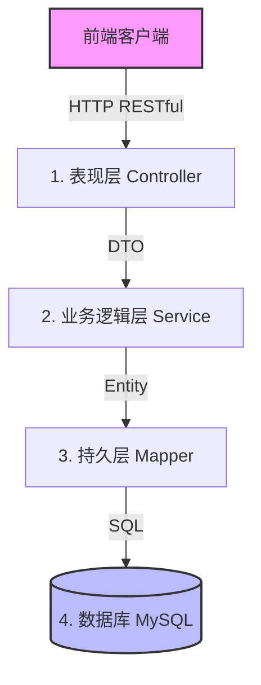
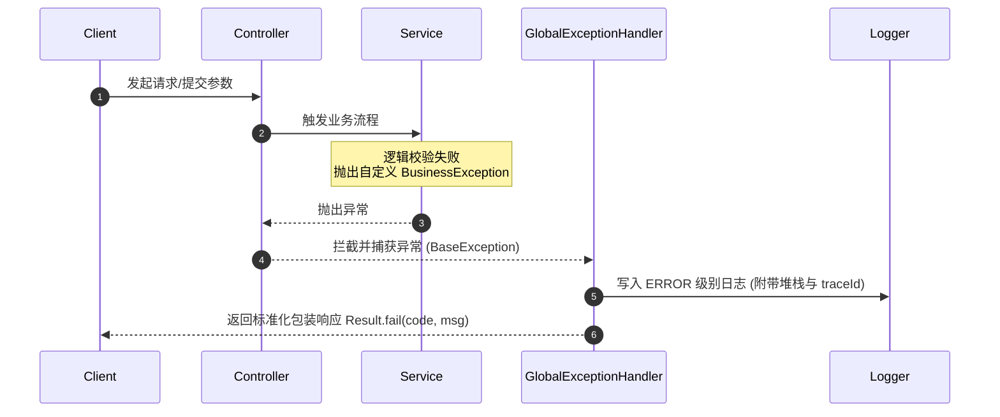

# 莱矿-档案管理系统技术规范文档 (Technical Specification)

本规范作为“莱矿-档案管理系统”开发团队的统一技术指导标准，旨在约束和规范后端开发习惯，明确核心技术决策，降低系统耦合度，保障档案数据的安全、合规与系统的高效运行。

## 1. 编码规范 (Coding Standards)

开发团队必须严格遵守以下 Java 及 Spring Boot 项目开发规范。

### 1.1 命名约定

- **包命名**：统一使用单数、小写名词。命名结构为 `com.laikuang.archive.[module].[layer]`（如 `com.laikuang.archive.borrow.service`）。
    
- **类命名**：
    
    - 类名采用大驼峰命名（`UpperCamelCase`）。
        
    - 接口实现类以 `Impl` 结尾（如 `ArchiveVolumeServiceImpl`）。
        
    - 控制器类以 `Controller` 结尾（如 `ArchiveVolumeController`）。
        
    - 数据访问接口以 `Mapper` 结尾（如 `ArchiveVolumeMapper`）。
        
- **变量与方法命名**：采用小驼峰命名（`lowerCamelCase`），如 `volumeTitle`，`generateArchiveNo()`。
    
- **常量命名**：统一使用大写，并用下划线分隔，如 `MAX_BORROW_DAYS`。
    

### 1.2 领域对象（POJO）定义与约束

为了避免各层数据污染，明确数据职责，严禁将实体（Entity）直接暴露给前端。

|   |   |   |
|---|---|---|
|**对象类型**|**全称**|**说明与业务职责**|
|**Entity**|数据库实体|严格与数据库表结构一一对应，仅用于持久层操作。|
|**DTO**|数据传输对象|前端向后端提交数据、内部微服务/模块间传输时的包装载体（如 `ArchiveVolumeSaveDTO`）。|
|**VO**|视图对象|后端向前端返回的视图展示载体，可包含多表联查及计算衍生数据（如 `ArchiveVolumeListVO`）。|

- **转换规范**：
    
    - 推荐使用 **MapStruct** 框架进行对象属性的高性能转换。
        
    - 严禁在多层级中频繁调用极其消耗反射性能的 `BeanUtils.copyProperties`。
        

## 2. 分层架构约定 (Layered Architecture Conventions)

本系统采用经典的**四层解耦单体架构**。各层级之间实行单向依赖，禁止逆向依赖。

### 2.1 整体分层及数据流向



### 2.2 各层级职责与边界定义

1. **表现层（Controller）**：
    
    - 只负责接收参数、做最基础的字段校验（如非空、长度等 `@Validated`）。
        
    - 调用 Service 层完成业务处理。
        
    - 不允许包含任何复杂的 SQL 查询逻辑或核心业务决策。
        
2. **业务逻辑层（Service）**：
    
    - 业务逻辑的核心载体，负责事务处理、多表协同、档号自动生成算法、审批流扭转等。
        
    - **事务控制**：在需要事务支持的方法上增加 `@Transactional(rollbackFor = Exception.class)`，确保异常时完全回滚。
        
3. **持久层（Mapper）**：
    
    - 基于 MyBatis-Plus 框架，仅执行与数据库的 CRUD 数据交互，不做多余的业务转换。
        
4. **领域模型与公共组件（Common/Domain）**：
    
    - 存放通用工具类、全局拦截配置、异常基类、常量字典等。
        

## 3. 异常处理标准 (Exception Handling Standards)

系统采用**主动防御、集中拦截**策略，不允许向前端暴露任何 Java 堆栈报错信息。

### 3.1 异常处理拓扑流



### 3.2 自定义异常继承体系

- `BaseException` (Runtime) - 全局异常基类
    
    - `BusinessException` - 核心业务异常（如：档号已重复、档案已借出、密码规则不匹配）
        
    - `SystemException` - 系统级内部异常（如：文件存储丢失、外部系统超时）
        
    - `UnauthorizedException` - 越权与未登录异常
        

### 3.3 统一响应封装 (Result)

所有 HTTP 接口必须统一返回 `Result<T>` 格式的 JSON 报文。

```
{
  "code": 4001,
  "msg": "该档案（档号：01.8.01.003）已被其他用户借出",
  "data": null,
  "traceId": "9f7b1d9c6e3b4a2e8c1a23456789abcd"
}
```

### 3.4 常用错误码规范表

|   |   |   |
|---|---|---|
|**错误区间**|**业务含义**|**典型示例**|
|**`2000`**|操作成功|业务正常交付|
|**`4000` - `4019`**|参数校验及基础异常|密码长度不足、非空字段为空|
|**`4020` - `4050`**|业务逻辑冲突限制|档号唯一性冲突、借阅天数超出阈值|
|**`401` / `403`**|鉴权与安全拦截|Token 校验失效、无领导审批权限|
|**`5000`**|系统未知崩溃|物理异常、数据库宕机、第三方系统断联|

## 4. 日志格式规范 (Log Format Standards)

日志是排查线上生产问题及审计借阅历史的唯一凭证，必须遵循结构化、可追溯规范。

### 4.1 日志输出等级规约

- `ERROR`：系统发生了**不可恢复或严重阻塞业务**的异常（如：数据库崩溃、文件批量写入完全失败、核心打印模板丢失）。必须记录完整的 Error 堆栈。
    
- `WARN`：业务处理发生非预期逻辑，但可以安全容错（如：档案过期未还自动预警失败、用户重复登录被挤下线、密码校验连续出错）。
    
- `INFO`：记录核心系统足迹（如：管理员正式确认档案归档、公司领导签署销毁文件）。
    
- `DEBUG`：开发调试使用，生产环境关闭。
    

### 4.2 结构化日志输出模板

所有应用日志必须通过 SLF4J 输出，在控制台和文件存储中统一输出格式：

```
[%d{yyyy-MM-dd HH:mm:ss.SSS}] [%X{traceId}] [%thread] [%-5level] %logger{50} - %msg%n
```

- `traceId`：使用 **MDC（Mapped Diagnostic Context）** 在入口拦截器中拦截请求并自动注入一个唯一的 UUID，确保单次请求在 Controller -> Service -> DB 的全链路日志中都带有相同的链路ID。
    

### 4.3 核心档案操作审计日志示例

档案在进行“高危行为”（如删除、销毁、驳回）时，必须记录带有明晰上下文字段的日志，例如：

```mermaid
log.info("[AUDIT-DESTROY] 操作用户ID: {}, 操作人: {}, 业务类型: 销毁审批, 状态: 批准通过, 目标案卷档号: {}, 销毁原因: {}", 
         currentUserId, nickname, archiveNo, destroyReason);
```

## 5. 安全编码要求 (Secure Coding Requirements)

档案管理系统属于企业敏感核心系统，代码层面必须构建全方位的立体防御体系。

### 5.1 身份鉴权与权限隔离 (3.1 - 3.3)

- **登录状态保持**：引入极简安全框架 **Sa-Token**，使用 JWT 保存会话状态，Token 存储在前端 HttpOnly Cookie 或 Request Header 中。
    
- **权限防御（垂直越权与水平越权）**：
    
    - 在 Controller 接口层使用注解控制权限，如 `@SaCheckPermission("archive:destroy")`。
        
    - **水平越权防范**：在借阅逻辑、草稿修改逻辑中，后端获取 DTO 传入的 ID 前，**必须**在数据库层校验 `compiler_id` 或 `borrower_id` 是否等于当前在线用户的 `currentUserId`。
        

### 5.2 敏感数据脱敏与高安全哈希 (3.2)

- **密码存储安全**：
    
    - 严禁使用明文或简单的 MD5 保存密码。
        
    - 必须使用带随机盐值的强哈希算法：推荐 **Argon2id**（Sa-Token 自带支持）或 **BCrypt**。
        
    - 密码校验规则后端拦截正则：
        
        ```
        ^(?=.*[A-Za-z])(?=.*\d)(?=.*[$@$!%*#?&])[A-Za-z\d$@$!%*#?&]{6,}$
        ```
        
- **日志/接口数据脱敏**：
    
    - 在输出日志和返回用户列表接口时，用户的手机号和密码字段应进行掩码处理。
        
    - 手机号脱敏：`138****5678`。密码直接不返回或序列化为 `******`。
        

### 5.3 防 SQL 注入、XSS 与文件安全

- **防 SQL 注入**：
    
    - 严禁使用 MyBatis 中的 `${}` 拼接字段名和查询条件。
        
    - 必须使用预编译的 `#{}` 占位符进行 SQL 解析。
        
    - 若必须拼装动态表字段，必须在代码中进行白名单过滤校验。
        
- **文件上传及下载漏洞防范**：
    
    1. **限制文件扩展名与 Content-Type**：只允许上传指定类型的档案附件（如 `.pdf`, `.docx`, `.xlsx`, `.zip`），避免 `.jsp`, `.sh` 等可执行脚本上传。
        
    2. **文件名唯一化**：后端存储时采用 `UUID.randomUUID().toString() + "_" + originalFilename` 重命名，防止发生同名覆盖漏洞。
        
    3. **存储隔离**：严禁将用户上传的文件直接放置于 Web 运行根目录下。上传文件应存储于专用的静态资源磁盘（如宿主机独立目录，通过 Nginx 代理映射只读），实现执行权隔离。