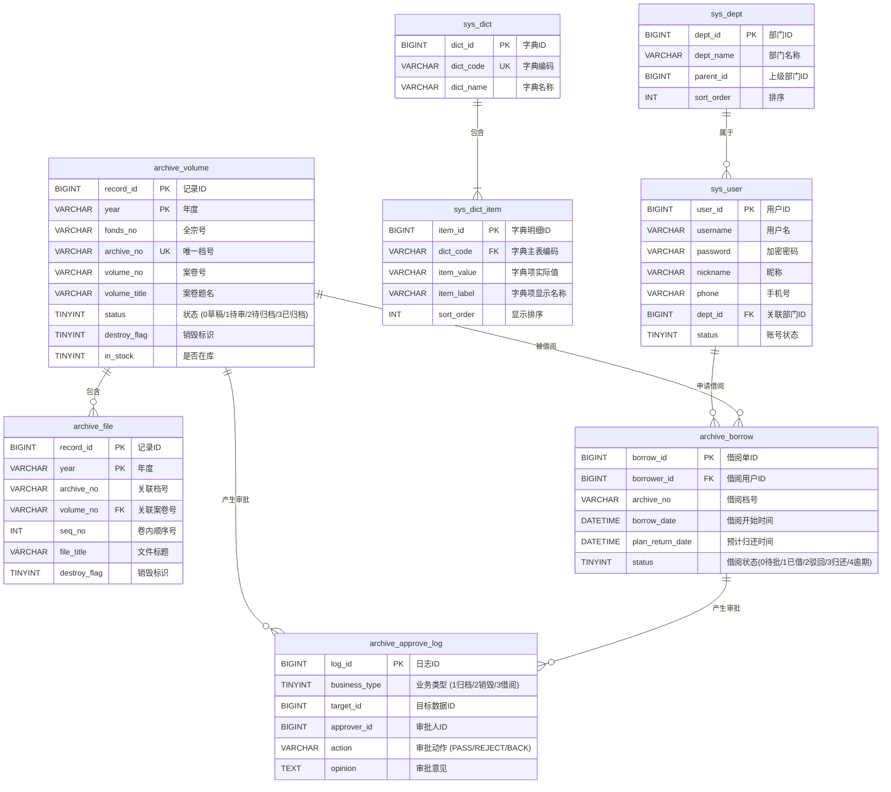

# 莱矿-档案管理系统数据库设计文档 (Database Design)

本数据库设计方案专为“莱矿-档案管理系统”量身定制。为了符合“简单、高效、易于维护”的单体架构设计原则，数据库设计采用 **MySQL 8.0 (InnoDB 引擎)**，充分结合档案业务高频检索、卷内关联、生命周期状态机及借阅归还流程。

## 1. 字段设计与注释规范

为了确保数据库开发及后期迭代的规范性，全库严格执行以下设计标准：

1. **命名规范**：
    
    - 表名和字段名统一使用**小写字母**加下划线命名法（`snake_case`）。
        
    - 系统管理表以 `sys_` 为前缀（如部门、用户、字典）；档案业务表以 `archive_` 为前缀（如案卷、文件、借阅、审批）。
        
2. **字符集与排序规则**：
    
    - 统一采用 `utf8mb4` 字符集，排序规则采用 `utf8mb4_0900_ai_ci`（或 `utf8mb4_general_ci`），以支持更广泛的特殊字符。
        
3. **主键策略**：
    
    - 统一使用 `BIGINT` 自增或 `VARCHAR(64)` 作为主键（无特殊分布式需求，优先推荐 `BIGINT` 自增，降低索引开销）。
        
4. **时间与审计字段**：
    
    - 每张表必须包含 `created_at`（创建时间）、`updated_at`（更新时间）字段。
        
    - 数据记录的状态字及布尔标示统一使用 `TINYINT(1)`，例如 `in_stock`（是否在库）、`destroy_flag`（销毁标识）。
        

## 2. 数据库实体关系图 (ERD)

莱矿档案系统核心由 **系统权限**、**数据字典**、**核心档案库（案卷级 & 文件级）** 以及 **流转业务（借阅 & 审批）** 四大部分构成。



## 3. 完整的建表 DDL (MySQL 8.0 兼容)

> **核心提示：** 为了支持**按年度（`year`）进行物理分区**，同时兼顾关系型数据库唯一性键（Unique Key / Primary Key）的索引约束，在 `archive_volume` 和 `archive_file` 表中，我们将主键设计为复合主键 `(record_id, year)`。

### 3.1 部门管理表 `sys_dept`

```
CREATE TABLE `sys_dept` (
  `dept_id` BIGINT NOT NULL AUTO_INCREMENT COMMENT '部门ID，自增主键',
  `dept_name` VARCHAR(100) NOT NULL COMMENT '部门名称',
  `parent_id` BIGINT DEFAULT 0 COMMENT '父级部门ID，顶层为0',
  `sort_order` INT DEFAULT 0 COMMENT '显示排序值',
  `created_at` DATETIME NOT NULL DEFAULT CURRENT_TIMESTAMP COMMENT '创建时间',
  `updated_at` DATETIME NOT NULL DEFAULT CURRENT_TIMESTAMP ON UPDATE CURRENT_TIMESTAMP COMMENT '更新时间',
  PRIMARY KEY (`dept_id`)
) ENGINE=InnoDB DEFAULT CHARSET=utf8mb4 COLLATE=utf8mb4_0900_ai_ci COMMENT='部门管理表';
```

### 3.2 用户管理表 `sys_user`

```
CREATE TABLE `sys_user` (
  `user_id` BIGINT NOT NULL AUTO_INCREMENT COMMENT '用户ID，自增主键',
  `username` VARCHAR(50) NOT NULL COMMENT '登录用户名',
  `password` VARCHAR(100) NOT NULL COMMENT '加密后的登录密码',
  `nickname` VARCHAR(50) NOT NULL COMMENT '用户真实姓名或昵称',
  `phone` VARCHAR(20) DEFAULT NULL COMMENT '联系手机号',
  `dept_id` BIGINT NOT NULL COMMENT '所属部门ID，关联sys_dept.dept_id',
  `status` TINYINT(1) DEFAULT 1 COMMENT '帐号状态：1-正常，0-禁用',
  `created_at` DATETIME NOT NULL DEFAULT CURRENT_TIMESTAMP COMMENT '创建时间',
  `updated_at` DATETIME NOT NULL DEFAULT CURRENT_TIMESTAMP ON UPDATE CURRENT_TIMESTAMP COMMENT '更新时间',
  PRIMARY KEY (`user_id`),
  UNIQUE KEY `uk_username` (`username`),
  KEY `idx_dept_id` (`dept_id`)
) ENGINE=InnoDB DEFAULT CHARSET=utf8mb4 COLLATE=utf8mb4_0900_ai_ci COMMENT='用户中心及基础信息表';
```

### 3.3 字典主表 `sys_dict`

```
CREATE TABLE `sys_dict` (
  `dict_id` BIGINT NOT NULL AUTO_INCREMENT COMMENT '字典ID，主键',
  `dict_code` VARCHAR(50) NOT NULL COMMENT '数据字典编码（如 retention_period, security_level）',
  `dict_name` VARCHAR(100) NOT NULL COMMENT '字典中文名称（如 保管期限, 密级）',
  `created_at` DATETIME NOT NULL DEFAULT CURRENT_TIMESTAMP COMMENT '创建时间',
  `updated_at` DATETIME NOT NULL DEFAULT CURRENT_TIMESTAMP ON UPDATE CURRENT_TIMESTAMP COMMENT '更新时间',
  PRIMARY KEY (`dict_id`),
  UNIQUE KEY `uk_dict_code` (`dict_code`)
) ENGINE=InnoDB DEFAULT CHARSET=utf8mb4 COLLATE=utf8mb4_0900_ai_ci COMMENT='数据字典主表';
```

### 3.4 字典项表 `sys_dict_item`

```
CREATE TABLE `sys_dict_item` (
  `item_id` BIGINT NOT NULL AUTO_INCREMENT COMMENT '字典明细项ID，主键',
  `dict_code` VARCHAR(50) NOT NULL COMMENT '数据字典主表编码，关联sys_dict.dict_code',
  `item_value` VARCHAR(50) NOT NULL COMMENT '数据字典实际值（存储于业务表中，如 30_years）',
  `item_label` VARCHAR(100) NOT NULL COMMENT '数据字典显示名称（前端展示用，如 30年）',
  `sort_order` INT DEFAULT 0 COMMENT '排序顺序',
  `created_at` DATETIME NOT NULL DEFAULT CURRENT_TIMESTAMP COMMENT '创建时间',
  `updated_at` DATETIME NOT NULL DEFAULT CURRENT_TIMESTAMP ON UPDATE CURRENT_TIMESTAMP COMMENT '更新时间',
  PRIMARY KEY (`item_id`),
  KEY `idx_dict_code` (`dict_code`)
) ENGINE=InnoDB DEFAULT CHARSET=utf8mb4 COLLATE=utf8mb4_0900_ai_ci COMMENT='数据字典项子表';
```

### 3.5 案卷级主目录表 `archive_volume` (已设计分区约束复合键)

```
CREATE TABLE `archive_volume` (
  `record_id` BIGINT NOT NULL AUTO_INCREMENT COMMENT '记录ID（与年度共同构成主键）',
  `fonds_no` VARCHAR(20) DEFAULT NULL COMMENT '全宗号',
  `year` VARCHAR(10) NOT NULL COMMENT '年度（用于逻辑分类及物理分区键）',
  `category_name` VARCHAR(50) DEFAULT NULL COMMENT '分类名称',
  `category_l1` VARCHAR(20) DEFAULT NULL COMMENT '一级类目',
  `category_l2` VARCHAR(20) DEFAULT NULL COMMENT '二级类目',
  `category_l3` VARCHAR(20) DEFAULT NULL COMMENT '三级类目',
  `device_code` VARCHAR(50) DEFAULT NULL COMMENT '设备代号',
  `volume_no` VARCHAR(20) DEFAULT NULL COMMENT '案卷号',
  `volume_title` VARCHAR(200) NOT NULL COMMENT '案卷题名',
  `file_count` INT DEFAULT 0 COMMENT '卷内文件件数',
  `total_pages` INT DEFAULT 0 COMMENT '案卷总页数',
  `compile_unit` VARCHAR(100) DEFAULT NULL COMMENT '编制单位',
  `compile_date` VARCHAR(50) DEFAULT NULL COMMENT '编制日期',
  `retention_period` VARCHAR(20) DEFAULT NULL COMMENT '保管期限',
  `security_level` VARCHAR(20) DEFAULT NULL COMMENT '密级',
  `compiler` VARCHAR(50) DEFAULT NULL COMMENT '立卷人',
  `compile_date_actual` DATE DEFAULT NULL COMMENT '立卷日期',
  `reviewer` VARCHAR(50) DEFAULT NULL COMMENT '审核人',
  `inspect_date` DATE DEFAULT NULL COMMENT '检查日期',
  `archive_date` DATE DEFAULT NULL COMMENT '归档日期',
  `notes` TEXT COMMENT '备考说明',
  `remark` TEXT COMMENT '备注',
  `archive_no` VARCHAR(50) NOT NULL COMMENT '档号（唯一性标识）',
  `category_code` VARCHAR(50) DEFAULT NULL COMMENT '分类号',
  `location_no` VARCHAR(50) DEFAULT NULL COMMENT '库位号',
  `in_stock` TINYINT(1) DEFAULT 1 COMMENT '是否在库：1-在库，0-借出',
  `register_date` DATE DEFAULT NULL COMMENT '登记日期',
  `organization` VARCHAR(100) DEFAULT NULL COMMENT '编制机构',
  `destroy_flag` TINYINT(1) DEFAULT 0 COMMENT '销毁标识：0-未销毁，1-已标记销毁',
  `copies` INT DEFAULT 1 COMMENT '总份数',
  `borrowed_copies` INT DEFAULT 0 COMMENT '已借出份数',
  `source_file` VARCHAR(200) DEFAULT NULL COMMENT '导入来源文件路径或名称',
  `status` TINYINT DEFAULT 0 COMMENT '档案状态：0-草稿，1-待审核，2-待确认，3-已正式归档',
  `created_at` DATETIME NOT NULL DEFAULT CURRENT_TIMESTAMP COMMENT '创建时间',
  `updated_at` DATETIME NOT NULL DEFAULT CURRENT_TIMESTAMP ON UPDATE CURRENT_TIMESTAMP COMMENT '更新时间',
  PRIMARY KEY (`record_id`, `year`),
  UNIQUE KEY `uk_archive_no_year` (`archive_no`, `year`),
  KEY `idx_year` (`year`),
  KEY `idx_fonds_no` (`fonds_no`),
  KEY `idx_category_l1` (`category_l1`),
  KEY `idx_volume_no` (`volume_no`),
  KEY `idx_composite_search` (`year`, `category_l1`, `status`)
) ENGINE=InnoDB DEFAULT CHARSET=utf8mb4 COLLATE=utf8mb4_0900_ai_ci
PARTITION BY RANGE COLUMNS(`year`) (
  PARTITION p_before_2020 VALUES LESS THAN ('2020'),
  PARTITION p_2020 VALUES LESS THAN ('2021'),
  PARTITION p_2021 VALUES LESS THAN ('2022'),
  PARTITION p_2022 VALUES LESS THAN ('2023'),
  PARTITION p_2023 VALUES LESS THAN ('2024'),
  PARTITION p_2024 VALUES LESS THAN ('2025'),
  PARTITION p_2025 VALUES LESS THAN ('2026'),
  PARTITION p_2026 VALUES LESS THAN ('2027'),
  PARTITION p_2027 VALUES LESS THAN ('2028'),
  PARTITION p_future VALUES LESS THAN (MAXVALUE)
);
```

### 3.6 文件级明细目录表 `archive_file` (已设计分区约束复合键)

```
CREATE TABLE `archive_file` (
  `record_id` BIGINT NOT NULL AUTO_INCREMENT COMMENT '记录ID（与年度共同构成主键）',
  `fonds_no` VARCHAR(20) DEFAULT NULL COMMENT '全宗号',
  `category_name` VARCHAR(50) DEFAULT NULL COMMENT '分类名称',
  `year` VARCHAR(10) NOT NULL COMMENT '年度（用于逻辑分类及物理分区键）',
  `category_l1` VARCHAR(20) DEFAULT NULL COMMENT '一级类目',
  `category_l2` VARCHAR(20) DEFAULT NULL COMMENT '二级类目',
  `category_l3` VARCHAR(20) DEFAULT NULL COMMENT '三级类目',
  `device_code` VARCHAR(50) DEFAULT NULL COMMENT '设备代号',
  `volume_no` VARCHAR(20) NOT NULL COMMENT '关联案卷号，关联archive_volume.volume_no',
  `seq_no` INT DEFAULT NULL COMMENT '卷内顺序号',
  `file_no` VARCHAR(50) DEFAULT NULL COMMENT '文件编号',
  `file_title` VARCHAR(200) NOT NULL COMMENT '文件标题',
  `responsible` VARCHAR(100) DEFAULT NULL COMMENT '责任者',
  `pages` INT DEFAULT 0 COMMENT '单份文件页数',
  `compile_date` VARCHAR(50) DEFAULT NULL COMMENT '编制日期',
  `keywords` VARCHAR(200) DEFAULT NULL COMMENT '主题词，多个用逗号隔开',
  `archive_date` DATE DEFAULT NULL COMMENT '归档日期',
  `security_level` VARCHAR(20) DEFAULT NULL COMMENT '密级',
  `original_path` VARCHAR(500) DEFAULT NULL COMMENT '原文电子文件电子版存储路径',
  `archive_no` VARCHAR(50) NOT NULL COMMENT '档号',
  `remark` TEXT COMMENT '备注',
  `retention_period` VARCHAR(20) DEFAULT NULL COMMENT '保管期限',
  `category_code` VARCHAR(50) DEFAULT NULL COMMENT '分类号',
  `drawing_size` VARCHAR(20) DEFAULT NULL COMMENT '图幅',
  `a4_equivalent` VARCHAR(20) DEFAULT NULL COMMENT '折合A4页数',
  `cabinet_no` VARCHAR(20) DEFAULT NULL COMMENT '保管橱号',
  `change_record` TEXT COMMENT '变更记载',
  `project_name` VARCHAR(200) DEFAULT NULL COMMENT '所属项目名称',
  `drawer_no` VARCHAR(20) DEFAULT NULL COMMENT '抽屉号',
  `page_start` VARCHAR(20) DEFAULT NULL COMMENT '卷内页次区间（如 1-15）',
  `archive_status` VARCHAR(20) DEFAULT NULL COMMENT '归档状态标记',
  `location_no` VARCHAR(50) DEFAULT NULL COMMENT '物理存放库位号',
  `in_stock` TINYINT(1) DEFAULT 1 COMMENT '是否在库：1-在库，0-借出',
  `organization` VARCHAR(100) DEFAULT NULL COMMENT '归档机构',
  `related_flag` VARCHAR(50) DEFAULT NULL COMMENT '关联关联标记',
  `destroy_flag` TINYINT(1) DEFAULT 0 COMMENT '销毁标识：0-正常，1-已标记销毁',
  `copies` INT DEFAULT 1 COMMENT '件数份数',
  `borrowed_copies` INT DEFAULT 0 COMMENT '已借出份数',
  `source_file` VARCHAR(200) DEFAULT NULL COMMENT '导入数据源文件',
  `status` TINYINT DEFAULT 0 COMMENT '文件状态：0-草稿，1-待审核，2-待确认，3-已正式归档',
  `created_at` DATETIME NOT NULL DEFAULT CURRENT_TIMESTAMP COMMENT '创建时间',
  `updated_at` DATETIME NOT NULL DEFAULT CURRENT_TIMESTAMP ON UPDATE CURRENT_TIMESTAMP COMMENT '更新时间',
  PRIMARY KEY (`record_id`, `year`),
  KEY `idx_year` (`year`),
  KEY `idx_volume_no` (`volume_no`),
  KEY `idx_archive_no` (`archive_no`),
  KEY `idx_file_title` (`file_title`),
  KEY `idx_volume_search` (`volume_no`, `seq_no`)
) ENGINE=InnoDB DEFAULT CHARSET=utf8mb4 COLLATE=utf8mb4_0900_ai_ci
PARTITION BY RANGE COLUMNS(`year`) (
  PARTITION p_before_2020 VALUES LESS THAN ('2020'),
  PARTITION p_2020 VALUES LESS THAN ('2021'),
  PARTITION p_2021 VALUES LESS THAN ('2022'),
  PARTITION p_2022 VALUES LESS THAN ('2023'),
  PARTITION p_2023 VALUES LESS THAN ('2024'),
  PARTITION p_2024 VALUES LESS THAN ('2025'),
  PARTITION p_2025 VALUES LESS THAN ('2026'),
  PARTITION p_2026 VALUES LESS THAN ('2027'),
  PARTITION p_2027 VALUES LESS THAN ('2028'),
  PARTITION p_future VALUES LESS THAN (MAXVALUE)
);
```

### 3.7 借阅申请及状态表 `archive_borrow`

```
CREATE TABLE `archive_borrow` (
  `borrow_id` BIGINT NOT NULL AUTO_INCREMENT COMMENT '借阅记录ID，自增主键',
  `borrower_id` BIGINT NOT NULL COMMENT '借阅申请人ID，关联sys_user.user_id',
  `borrower_dept` VARCHAR(100) NOT NULL COMMENT '借阅人所在部门，防止用户部门变更产生历史数据偏差',
  `archive_no` VARCHAR(50) NOT NULL COMMENT '申请借阅的案卷/文件档号',
  `borrow_date` DATETIME DEFAULT NULL COMMENT '实际借出日期',
  `plan_return_date` DATETIME DEFAULT NULL COMMENT '预计归还日期',
  `actual_return_date` DATETIME DEFAULT NULL COMMENT '实际归还日期',
  `status` TINYINT NOT NULL DEFAULT 0 COMMENT '借阅申请状态：0-待审批，1-已借出/已批准，2-已驳回，3-已归还，4-逾期未归还',
  `created_at` DATETIME NOT NULL DEFAULT CURRENT_TIMESTAMP COMMENT '申请发起时间',
  `updated_at` DATETIME NOT NULL DEFAULT CURRENT_TIMESTAMP ON UPDATE CURRENT_TIMESTAMP COMMENT '记录更新时间',
  PRIMARY KEY (`borrow_id`),
  KEY `idx_borrower` (`borrower_id`),
  KEY `idx_archive_no` (`archive_no`),
  KEY `idx_status_remind` (`status`, `plan_return_date`)
) ENGINE=InnoDB DEFAULT CHARSET=utf8mb4 COLLATE=utf8mb4_0900_ai_ci COMMENT='档案借阅申请及状态流转表';
```

### 3.8 审批历史及审计日志表 `archive_approve_log`

```
CREATE TABLE `archive_approve_log` (
  `log_id` BIGINT NOT NULL AUTO_INCREMENT COMMENT '审批日志ID，自增主键',
  `business_type` TINYINT NOT NULL COMMENT '业务类型：1-新建案卷归档审核，2-案卷正式归档确认，3-公司领导销毁/删除审批，4-借阅申请审批',
  `target_id` BIGINT NOT NULL COMMENT '审批对应目标业务ID (如 volume表的record_id或borrow表的borrow_id)',
  `approver_id` BIGINT NOT NULL COMMENT '当前节点审批人ID，关联sys_user.user_id',
  `action` VARCHAR(20) NOT NULL COMMENT '审批操作：PASS-通过，REJECT-驳回，BACK-退回',
  `opinion` TEXT COMMENT '审批人签署意见说明',
  `created_at` DATETIME NOT NULL DEFAULT CURRENT_TIMESTAMP COMMENT '审批时间',
  PRIMARY KEY (`log_id`),
  KEY `idx_target_business` (`business_type`, `target_id`),
  KEY `idx_approver` (`approver_id`)
) ENGINE=InnoDB DEFAULT CHARSET=utf8mb4 COLLATE=utf8mb4_0900_ai_ci COMMENT='档案流程审批历史及审计日志表';
```

## 4. 索引设计策略 (Index Strategy)

档案系统的主要吞吐特征为：**写少读多、多维度联合精确过滤（年度、类目）、全局模糊查询（题名、标题）**。以下是精心建立的索引配置策略：

### 4.1 核心索引分类与优化意图

1. **唯一联合索引 (`uk_archive_no_year`)**：
    
    - 在案卷主目录表 `archive_volume` 中，档号 `archive_no` 虽在逻辑上是系统全局唯一的，但根据 MySQL 物理分区的规则，“表的所有唯一索引和主键必须包含物理分区键（`year`）”。因此，我们建立了 `(archive_no, year)` 的复合唯一索引，保障了分区间唯一性的底层要求，同时在数据库层杜绝了重档隐患。
        
2. **复合高频查询索引 (`idx_composite_search`)**：
    
    - 在 `archive_volume` 中配置了 `(year, category_l1, status)`。
        
    - **优化意图**：用户和管理员在做日常筛选时，极其高频地在“**2026年度、一级类目:文书档案、已归档(status=3)**”这类条件下切换，利用最左前缀原则（Leftmost Prefix Rule）能大幅减少全表扫描，极大降低 IO 瓶颈。
        
3. **单文件级案卷内检索优化 (`idx_volume_search`)**：
    
    - 在 `archive_file` 表中配置 `(volume_no, seq_no)` 复合索引。
        
    - **优化意图**：当系统打印“案卷内卷内目录”或用户在案卷级下点击展示卷内明细时，底层系统依靠 `volume_no` 查找文件的耗时接近 $O(\log N)$，并且利用索引的物理顺序直接实现 `seq_no`（顺序号）免排序，直接提升文件列表的展示速度。
        
4. **借阅预警扫描索引 (`idx_status_remind`)**：
    
    - 在 `archive_borrow` 表中配置 `(status, plan_return_date)`。
        
    - **优化意图**：后台轮询定时任务（Spring Scheduled 凌晨启动）在跑“逾期催还”和“到期提醒”时，只需执行 `SELECT ... WHERE status = 1 AND plan_return_date < NOW()`，该复合索引可以让扫描范围限定在极小的已借出数据集内。
        

## 5. 档案系统分区策略 (Partitioning Strategy)

莱矿档案系统随着时间积累，年级档案数据量会稳定成倍递增。为了能够承载数百万级别的档案明细，我们设计了以下精简、低成本的物理分区方案：

### 5.1 为什么采用 Range Columns 分区？

- **物理隔离**：根据年度（`year`）作为分区键，能够完美对高负荷的历史数据和当前高频读写的活跃数据做物理分块。
    
- **MySQL 8.0 `RANGE COLUMNS` 支持**：由于需求表结构中 `year` 为 `VARCHAR(10)`，传统的 `PARTITION BY RANGE` 必须在分区键上使用函数（如返回数字）。而在 MySQL 8.0 中，利用 `PARTITION BY RANGE COLUMNS(year)` 可**无需任何转换函数直接按字符串进行区间范围物理分区**。
    
- **易维护性**：一旦遇到 3.5 节公司领导审批的“档案物理标记销毁/彻底丢弃”，可以直接针对某个无用年代的 Partition 进行整片裁撤（`ALTER TABLE archive_volume DROP PARTITION`），效率远超执行 `DELETE` 产生的大量日志碎片。
    

### 5.2 历史与未来区间定义

我们在 DDL 中已经定义了常用的分区区间：

- `p_before_2020`：集中历史陈旧数据。
    
- `p_2020` ~ `p_2027`：逐年单独分区。
    
- `p_future`：所有超出当前业务年份的值都将进入此大分区。
    

### 5.3 分区表日常维护（扩充未来年份分区）

在日常运维中，若需要临近新的一年，只需对表执行一键切分扩容（假定当前准备进入 2028 年）：

```
-- 将原先的未来分区（p_future）重新切分出 2028 年独立分区
ALTER TABLE `archive_volume` REORGANIZE PARTITION p_future INTO (
  PARTITION p_2028 VALUES LESS THAN ('2029'),
  PARTITION p_future VALUES LESS THAN (MAXVALUE)
);

ALTER TABLE `archive_file` REORGANIZE PARTITION p_future INTO (
  PARTITION p_2028 VALUES LESS THAN ('2029'),
  PARTITION p_future VALUES LESS THAN (MAXVALUE)
);
```

## 6. 核心业务流程与 SQL 操作示例

### 6.1 档号组装与查重 (3.9)

在保存新建档案时，档号生成规则为 `全宗号.一级类目.二级类目.三级类目.设备代号.案卷号`。

后端在进行持久化前需要校验该档号在此年度是否唯一：

```
SELECT COUNT(1) 
FROM archive_volume 
WHERE archive_no = '01.8.01.0101.01.003' AND year = '2026';
```

### 6.2 借阅到期未归还监控 (3.7)

管理员用于提取出全部已超期但还未归还的档案列表：

```
SELECT ab.borrow_id, u.nickname, u.phone, ab.archive_no, ab.plan_return_date
FROM archive_borrow ab
JOIN sys_user u ON ab.borrower_id = u.user_id
WHERE ab.status = 1 
  AND ab.plan_return_date < NOW();
```

### 6.3 逻辑删除与领导审批销毁 (3.5)

为了遵循档案管理的安全底线，不允许物理执行 `DELETE`。在系统设计中执行逻辑删除和销毁标记：

1. **用户申请删除，案卷状态置为临时下线（不删除，不销毁，待审批）：**
    
    ```
    UPDATE archive_volume 
    SET status = 0 -- 撤回到草稿或设置特定离线状态
    WHERE record_id = 12051 AND year = '2026';
    ```
    
2. **公司领导审批通过销毁，更改销毁标识（`destroy_flag`）：**
    
    ```
    UPDATE archive_volume 
    SET destroy_flag = 1 
    WHERE record_id = 12051 AND year = '2026';
    ```
    
3. **日常检索，排除已销毁档案：**
    
    ```
    SELECT * FROM archive_volume 
    WHERE destroy_flag = 0 AND status = 3;
    ```